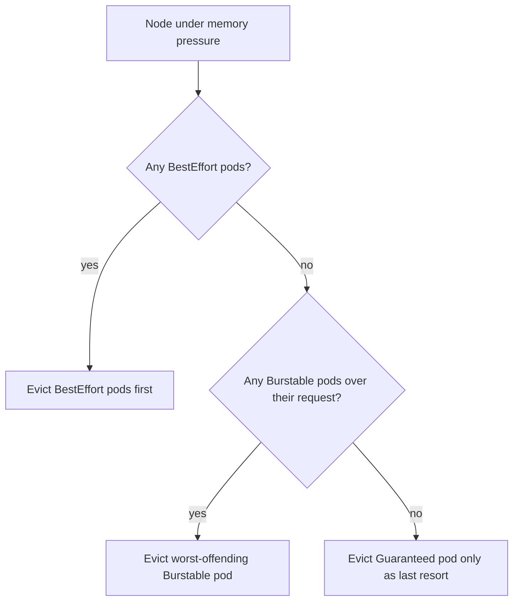

# Resource Requests, Limits, and QoS

## What You'll Learn

- The real difference between a request and a limit, and what each one actually controls
- The three Quality of Service (QoS) classes and how they decide which pods get evicted first under pressure
- How `LimitRange` and `ResourceQuota` enforce sane defaults and ceilings across a namespace

## Why This Matters

Requests and limits aren't optional metadata — they're the numbers the scheduler uses to decide if a pod fits on a node, and the numbers the kubelet uses to decide which pod dies first when a node runs low on memory. A pod with no requests set isn't "unconstrained" — it's first in line for eviction and invisible to the scheduler's capacity math.

## Mental Model

> **Requests** are what the scheduler reserves for a pod when deciding which node it fits on. **Limits** are a hard ceiling the kubelet enforces at runtime. CPU limits get you throttled; memory limits get you OOM-killed.

| | Requests | Limits |
|---|---|---|
| Used by | Scheduler (bin-packing / node fit) | kubelet / container runtime (runtime enforcement) |
| CPU over | N/A — CPU requests aren't a hard ceiling | Throttled (CFS quota) |
| Memory over | N/A | Container OOM-killed |
| Omitted | Node capacity math treats the pod as needing nothing — dangerous | No ceiling — a leak can consume the whole node |

```yaml
apiVersion: v1
kind: Pod
metadata:
  name: checkout-api
spec:
  containers:
    - name: checkout-api
      image: registry.example.com/checkout-api:1.14.2
      resources:
        requests:
          cpu: 250m
          memory: 256Mi
        limits:
          cpu: 500m
          memory: 512Mi
```

## QoS Classes

Kubernetes derives a QoS class per pod automatically from its requests/limits — you never set it directly.

| Class | How it's assigned | Eviction priority under node pressure |
|---|---|---|
| **Guaranteed** | Every container sets requests == limits, for both CPU and memory | Evicted last |
| **Burstable** | At least one container sets a request or limit, but not equal on both | Evicted after BestEffort, before Guaranteed |
| **BestEffort** | No requests or limits set on any container | Evicted first |

```bash
kubectl get pod checkout-api -o jsonpath='{.status.qosClass}'
```

Under memory pressure, the kubelet evicts pods in **BestEffort → Burstable → Guaranteed** order (within a tier, it further ranks by how far usage exceeds requests). This is exactly why "just don't set limits" is a bad instinct — you get BestEffort, the first thing killed when the node is tight.



## Enforcing Defaults and Ceilings

### LimitRange — per-container/pod defaults and bounds

```yaml
apiVersion: v1
kind: LimitRange
metadata:
  name: default-limits
  namespace: production
spec:
  limits:
    - type: Container
      default:
        cpu: 500m
        memory: 512Mi
      defaultRequest:
        cpu: 250m
        memory: 256Mi
      max:
        cpu: "2"
        memory: 2Gi
      min:
        cpu: 100m
        memory: 128Mi
```

Any container in `production` that omits requests/limits gets `defaultRequest`/`default` applied automatically, and the API server rejects anything outside `min`/`max`.

### ResourceQuota — namespace-wide ceiling

```yaml
apiVersion: v1
kind: ResourceQuota
metadata:
  name: production-quota
  namespace: production
spec:
  hard:
    requests.cpu: "20"
    requests.memory: 40Gi
    limits.cpu: "40"
    limits.memory: 80Gi
    pods: "100"
```

If a `ResourceQuota` covers `requests.cpu`/`requests.memory`, every pod in that namespace **must** specify requests, or the API server rejects it — this is the enforcement mechanism that stops BestEffort pods from silently sneaking into a quota-managed namespace.

## Common Mistakes

- Setting a memory limit without a matching request (or vice versa) without understanding it produces Burstable, not Guaranteed, QoS.
- Assuming CPU limits behave like memory limits — a CPU limit throttles (slows the process down), it never kills the container the way a memory limit does.
- Setting requests far below real usage "to fit more pods per node" — the pod schedules fine, then gets evicted or throttled constantly once real traffic hits.
- Forgetting that `ResourceQuota` on `requests.cpu`/`requests.memory` makes requests mandatory — deployments that "just apply" start failing in a quota-enforced namespace with no request set.
- Not setting `LimitRange` defaults in shared namespaces, so a forgotten `resources:` block turns into an accidental BestEffort pod.

## Interview Questions

- What actually happens when a container exceeds its CPU limit, versus its memory limit?
- Given requests and limits, how does Kubernetes derive a pod's QoS class, and how does that class affect eviction order?
- What's the difference between what `LimitRange` and `ResourceQuota` each enforce?

See [Interview Prep](../interview-prep/index.md) for full answers.

## Next

Continue to [Autoscaling](06-autoscaling.md) to see how requests feed directly into HPA, VPA, and Cluster Autoscaler decisions.
