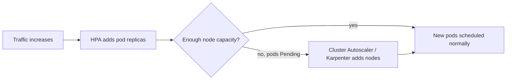

# Autoscaling

## What You'll Learn

- What each of HPA, VPA, and Cluster Autoscaler actually scales, and why they're separate controllers
- How to configure `autoscaling/v2` HPA with resource, custom, and external metrics
- Where these autoscalers interact — and where combining them wrongly causes fighting or thrashing

## Why This Matters

"Autoscaling" in Kubernetes isn't one thing. Three independent controllers scale three independent dimensions — pod count, per-pod resource sizing, and node count — and none of them is aware of the others by default. Wiring them up naively (HPA and VPA both managing CPU on the same Deployment, for instance) produces oscillation instead of stability.

## Mental Model

| Autoscaler | Scales | Trigger | Acts on |
|---|---|---|---|
| **HPA** (HorizontalPodAutoscaler) | Number of pod replicas | Metric crosses a target threshold | `Deployment`/`StatefulSet` `.spec.replicas` |
| **VPA** (VerticalPodAutoscaler) | Per-pod CPU/memory requests | Historical usage vs. current requests | Pod's `resources.requests` (recreates pods to apply) |
| **Cluster Autoscaler / Karpenter** | Number of nodes | Unschedulable pods, or underutilized nodes | Node pool / node group size |



## HorizontalPodAutoscaler (`autoscaling/v2`)

```yaml
apiVersion: autoscaling/v2
kind: HorizontalPodAutoscaler
metadata:
  name: checkout-api-hpa
spec:
  scaleTargetRef:
    apiVersion: apps/v1
    kind: Deployment
    name: checkout-api
  minReplicas: 3
  maxReplicas: 20
  metrics:
    - type: Resource
      resource:
        name: cpu
        target:
          type: Utilization
          averageUtilization: 70
    - type: Pods
      pods:
        metric:
          name: http_requests_per_second
        target:
          type: AverageValue
          averageValue: "500"
    - type: External
      external:
        metric:
          name: sqs_queue_depth
          selector:
            matchLabels:
              queue: checkout-jobs
        target:
          type: AverageValue
          averageValue: "100"
  behavior:
    scaleDown:
      stabilizationWindowSeconds: 300
      policies:
        - type: Percent
          value: 25
          periodSeconds: 60
    scaleUp:
      stabilizationWindowSeconds: 0
      policies:
        - type: Pods
          value: 4
          periodSeconds: 60
```

- **Resource metrics** (CPU/memory utilization) need the `metrics-server` add-on installed.
- **Pods metrics** (custom, per-pod, e.g. requests/sec) need a custom metrics adapter (e.g. Prometheus Adapter).
- **External metrics** (something outside the cluster, e.g. an SQS queue depth) need an external metrics adapter for that source.
- `behavior` controls scale-up/scale-down speed independently — a longer `stabilizationWindowSeconds` on scale-down avoids flapping when a traffic spike is brief.

HPA **requires requests to be set** on the target's containers — utilization percentages are computed against `resources.requests`, not limits.

```bash
kubectl get hpa checkout-api-hpa
kubectl describe hpa checkout-api-hpa
kubectl autoscale deployment checkout-api --cpu-percent=70 --min=3 --max=20
```

## VerticalPodAutoscaler

```yaml
apiVersion: autoscaling.k8s.io/v1
kind: VerticalPodAutoscaler
metadata:
  name: checkout-api-vpa
spec:
  targetRef:
    apiVersion: apps/v1
    kind: Deployment
    name: checkout-api
  updatePolicy:
    updateMode: "InPlaceOrRecreate"   # Off | Initial | Recreate | InPlaceOrRecreate
  resourcePolicy:
    containerPolicies:
      - containerName: checkout-api
        minAllowed:
          cpu: 100m
          memory: 128Mi
        maxAllowed:
          cpu: "2"
          memory: 2Gi
```

VPA watches actual usage over time and recommends (or, in an active mode, applies) better `requests`/`limits` — it fixes the "everyone guessed their resource requests wrong" problem HPA can't touch, because HPA only changes replica *count*, never per-pod sizing.

How a new size gets applied depends on the mode and your cluster version:

| `updateMode` | What VPA does |
|---|---|
| `Off` | Only publishes recommendations (`kubectl describe vpa`). The safe way to start. |
| `Initial` | Sets requests when a Pod is created; never touches running Pods |
| `Recreate` | Evicts Pods and recreates them with new requests (the older `Auto` value behaves this way) |
| `InPlaceOrRecreate` | Resizes running Pods **in place** where possible, and only evicts when a resize can't be applied. Newer VPA releases only (1.4+); check it's enabled in yours |

In-place resizing relies on **in-place Pod resize**, stable since Kubernetes v1.35: a Pod's CPU and memory can change without restarting it. You can use it directly too:

```bash
kubectl patch pod checkout-api-7d9f8-x2kq1 --subresource resize --patch \
  '{"spec":{"containers":[{"name":"checkout-api","resources":{"requests":{"cpu":"500m"},"limits":{"cpu":"1"}}}]}}'
```

CPU changes apply live. Memory changes may require a container restart, depending on the container's `resizePolicy`.

## HPA vs VPA: Which One to Use

| | HPA | VPA |
|---|---|---|
| Changes | Number of replicas | CPU and memory requests of each pod |
| Fits | Stateless services where more copies share the load | Workloads that can't scale out, or whose requests were guessed |
| Applies a change by | Adding or removing pods | Recreating pods with new requests (unless `updateMode` is `Off` or `Initial`) |
| Built in | Yes, `autoscaling/v2` | No, you install the VPA components separately |

Start with HPA for stateless services. Run VPA with `updateMode: "Off"` to get sizing recommendations without restarts. Use both on the same workload only when they watch different signals, as the table below explains.

## Cluster Autoscaler and Karpenter

Cluster Autoscaler watches for pods stuck `Pending` due to insufficient node capacity and adds nodes to a configured node group; it also scales down nodes that are underutilized and whose pods can be safely rescheduled elsewhere.

**Karpenter** is a newer, more flexible alternative (originally AWS, now also on Azure as AKS Node Auto Provisioning) that provisions right-sized nodes directly from instance-type flexibility rather than fixed node groups — it reacts faster and bin-packs more efficiently, and is increasingly the default choice over Cluster Autoscaler on AWS.

## Event-Driven Scaling With KEDA

HPA scales on metrics. When the real signal is **work waiting** — messages in a queue, lag on a Kafka topic, rows in a table — [KEDA](https://keda.sh/) is the usual answer. It ships dozens of ready-made scalers (SQS, RabbitMQ, Kafka, Prometheus queries, cron) and can scale a Deployment **to zero** when there's nothing to do, which plain HPA can't:

```yaml
apiVersion: keda.sh/v1alpha1
kind: ScaledObject
metadata:
  name: invoice-worker
spec:
  scaleTargetRef:
    name: invoice-worker          # the Deployment to scale
  minReplicaCount: 0              # no messages, no Pods
  maxReplicaCount: 30
  triggers:
    - type: aws-sqs-queue
      metadata:
        queueURL: https://sqs.eu-west-1.amazonaws.com/123456789012/invoices
        queueLength: "50"         # target messages per replica
        awsRegion: eu-west-1
      authenticationRef:
        name: keda-aws-irsa
```

KEDA creates and manages an HPA under the hood, so the same `behavior` tuning applies. Scale-to-zero suits background workers; for user-facing services, the cold start when the first request arrives usually rules it out.

```bash
kubectl get pods --field-selector=status.phase=Pending
kubectl describe pod <pending-pod>   # look for "Insufficient cpu/memory" events
```

## How They Interact — and Conflict

| Combination | Result |
|---|---|
| HPA + Cluster Autoscaler | The intended pipeline: HPA adds pods, Cluster Autoscaler adds nodes if pods can't schedule. Works well together. |
| HPA + VPA on the **same metric** (e.g. both watching CPU) | They fight: VPA resizes the pod (changing what "70% utilization" means), HPA reacts to the resulting shift and changes replica count, VPA reacts to the new usage pattern. Avoid — if using both, have VPA manage memory only, HPA manage CPU/custom metrics, or use VPA in `Off` mode for recommendations only. |
| VPA in `Auto` mode on a low-replica-count workload | Pod recreation for a resize can cause a brief availability dip if `minReplicas` is 1 — pair with `PodDisruptionBudget`. |
| Cluster Autoscaler + workloads without requests set | Cluster Autoscaler can't reason about capacity for pods with no requests — they either schedule opportunistically or leave scale-up decisions wrong. |

## Common Mistakes

- Running HPA and VPA on the same resource dimension for the same workload without coordinating — this is the single most common autoscaling misconfiguration.
- Setting `minReplicas: 1` with an aggressive VPA `Auto` policy and no PodDisruptionBudget — a routine VPA resize becomes a mini-outage.
- Forgetting `metrics-server` (or the relevant custom/external adapter) is a prerequisite — HPA silently reports `<unknown>` for targets it can't read.
- Expecting Cluster Autoscaler to add nodes for a pod that will never fit any configured node type/size — it correctly gives up, and the pod stays `Pending`.
- Not setting `behavior.scaleDown.stabilizationWindowSeconds` — the default cooldown may be too twitchy for spiky traffic, causing replica count to flap.
- Scaling a queue worker on CPU. CPU lags behind the queue; scale on queue depth or lag (KEDA) instead.
- `maxReplicas` set higher than a downstream dependency can take. Twenty new API pods can exhaust a database's connection limit faster than the load they were added to handle.

## Interview Questions

- What's the practical difference between what HPA, VPA, and Cluster Autoscaler each scale?
- Why is running HPA and VPA on the same metric for the same workload a bad idea?
- How does HPA compute CPU utilization, and why does that mean requests must be set on the target workload?
- How does Karpenter's approach to node provisioning differ from Cluster Autoscaler's?

See [Interview Prep](../interview-prep/index.md) for full answers.

## Next

Continue to [Networking](../networking/index.md) to see how traffic actually reaches these scaled, scheduled pods.
