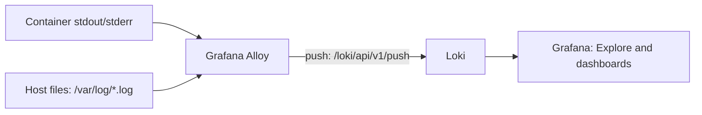

# Loki Logging With Grafana Alloy

## What You'll Learn

- How log lines travel from a container or host file into Loki and onto a Grafana panel
- Why Grafana Alloy replaced Promtail, and how to convert an existing Promtail config
- How to choose Loki labels that keep queries fast instead of exploding stream counts

!!! warning "Promtail reached end of life on March 2, 2026"
    Promtail entered long-term support in February 2025 and is no longer maintained. **Grafana Alloy** is the supported collector for Loki. The [Monitoring lab repository](https://github.com/sameeralam3127/Monitoring) still ships a `promtail/` directory — it keeps working for local practice, but use Alloy for anything new and follow the migration steps below for existing setups.

## Why This Matters

Metrics tell you *that* the error rate jumped; logs tell you *which* request failed and why. A logging pipeline that silently drops lines, or one whose labels make every query scan the whole store, fails exactly when you need it during an incident.

## Mental Model

> Loki stores **streams**. A stream is every log line that shares the exact same label set. The collector (Alloy) decides which files or containers to read and which labels to attach; Loki only indexes those labels, never the log text itself.



## How the Flow Works

1. Alloy discovers log sources — Docker containers through the Docker socket, and host files by path glob.
2. Alloy attaches labels (container, job, environment) and batches lines.
3. Alloy pushes batches to Loki's push API.
4. Loki stores the lines compressed, grouped by stream, and indexes only the labels.
5. Grafana queries Loki with LogQL.

## Important Files

| File | Purpose |
|---|---|
| `loki/loki-config.yml` | Loki storage, retention, and limits |
| `alloy/config.alloy` | Log discovery, labels, and where to push |
| `promtail/promtail-config.yml` | Legacy collector config in the lab repo — convert it, then retire it |

## A Working Alloy Config

```alloy title="alloy/config.alloy"
// Discover running Docker containers
discovery.docker "containers" {
  host = "unix:///var/run/docker.sock"
}

// Turn the "/orders-api" container name into a clean label
discovery.relabel "containers" {
  targets = []

  rule {
    source_labels = ["__meta_docker_container_name"]
    regex         = "/(.*)"
    target_label  = "container"
  }
}

loki.source.docker "containers" {
  host          = "unix:///var/run/docker.sock"
  targets       = discovery.docker.containers.targets
  relabel_rules = discovery.relabel.containers.rules
  forward_to    = [loki.write.local.receiver]
}

// Host log files
local.file_match "system" {
  path_targets = [{"__path__" = "/var/log/*.log", "job" = "varlogs"}]
}

loki.source.file "system" {
  targets    = local.file_match.system.targets
  forward_to = [loki.write.local.receiver]
}

loki.write "local" {
  endpoint {
    url = "http://loki:3100/loki/api/v1/push"
  }
}
```

Run it next to Loki in Compose:

```yaml title="docker-compose.yml (excerpt)"
services:
  alloy:
    image: grafana/alloy:latest
    command:
      - run
      - --server.http.listen-addr=0.0.0.0:12345
      - --storage.path=/var/lib/alloy/data
      - /etc/alloy/config.alloy
    ports:
      - "12345:12345"   # Alloy UI: component graph and health
    volumes:
      - ./alloy/config.alloy:/etc/alloy/config.alloy:ro
      - /var/run/docker.sock:/var/run/docker.sock:ro
      - /var/log:/var/log:ro
    depends_on:
      - loki
```

Pin `grafana/alloy` to a specific release tag once the lab works — `latest` is fine for a first run, not for anything you need to reproduce.

## Migrating From Promtail

Alloy ships a converter, so you rarely rewrite a Promtail config by hand:

```bash
alloy convert --source-format=promtail \
  --output=alloy/config.alloy \
  promtail/promtail-config.yml
```

Then:

1. Read the generated file — the converter reports anything it could not translate.
2. Start Alloy **alongside** Promtail against a test Loki, and compare the streams in Grafana Explore.
3. Stop Promtail and remove its service from Compose once the label sets match.

## Choosing Labels

Keep high-cardinality values such as request IDs inside the log body or parsed fields, not as Loki stream labels. Every unique label combination creates a new stream; a `request_id` label turns one stream into millions.

| Good labels (low cardinality) | Keep in the log body |
|---|---|
| `service`, `container`, `environment`, `cluster`, `job` | `request_id`, `trace_id`, `user_id`, IP addresses, URLs |

Make application logs queryable by emitting stable fields rather than relying only on text. A useful event includes timestamp, level, service, environment, event name, request ID, and trace ID when tracing is enabled.

```json
{"level":"ERROR","service":"orders-api","event":"payment_authorization_failed","request_id":"req-8f52","trace_id":"4bf92f..."}
```

Query the body fields at read time instead:

```logql
{container="orders-api"} | json | level="ERROR" | request_id="req-8f52"
```

## Quick Check

```bash
docker compose logs -f alloy
docker compose logs -f loki
curl http://localhost:3100/ready          # Loki: "ready"
open http://localhost:12345               # Alloy UI: every component should be healthy
```

## Common Mistakes

- Starting a new setup on Promtail because an older tutorial used it — it no longer receives fixes, including security fixes.
- Adding `request_id`, `user_id`, or a full URL as a label, creating a stream explosion that makes Loki slow and expensive.
- Forgetting to mount the Docker socket or `/var/log` read-only into the Alloy container, so the pipeline starts "healthy" with nothing to read.
- Writing application logs to a file inside the container instead of stdout/stderr, where the collector never sees them.
- Shipping secrets or personal data because nothing redacts them before `loki.write`.

## Interview Questions

- What is a Loki stream, and why does label cardinality matter so much more in Loki than in a full-text log store?
- Why did Grafana replace Promtail with Alloy, and how would you migrate a production Promtail deployment safely?
- A developer wants to add `request_id` as a label to make searches faster. What do you tell them?

## Next

Continue to [Python Logging in Practice](python-logging.md) to emit the structured JSON logs this pipeline is built to query. For how the same pattern works inside a cluster, see [Kubernetes Logging](../kubernetes/observability/02-logging.md).
