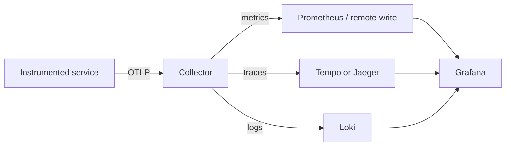

# OpenTelemetry and Other Observability Platforms

## What You'll Learn

- How telemetry flows from an instrumented application through the OpenTelemetry Collector
- Core concepts: spans, traces, resources, and context propagation
- How to instrument a Python service
- How to choose between self-hosted and managed observability platforms

OpenTelemetry (OTel) is a vendor-neutral framework for generating, processing, and exporting traces, metrics, logs, and events. It is not a storage backend or dashboard by itself. Applications use SDKs and auto-instrumentation; the OpenTelemetry Collector receives, enriches, samples, and forwards telemetry to one or more backends.

## The OTel Data Path



The Collector is valuable because applications speak one protocol (usually OTLP) while the operations team can change or add destinations without revising every service.

## Core Concepts

- **Resource attributes** identify the producer: `service.name`, `service.version`, `deployment.environment`, region, and cluster.
- **Spans** represent timed operations; a trace is the complete tree of spans for one transaction.
- **Context propagation** passes trace context through HTTP, messaging, and RPC boundaries.
- **Sampling** reduces trace volume. Keep error and slow traces; be cautious with head sampling when errors are rare.
- **Baggage** carries small cross-service context, but it should not contain secrets or high-cardinality user data.

## A Practical Collector Starting Point

Start with a gateway Collector for each environment and a local agent where host-local collection is needed. Add resource attributes, batch telemetry, expose the Collector's own metrics, and use TLS plus authenticated endpoints in production. Do not make the Collector a silent single point of failure: use replicas and monitor queued, dropped, and failed exports.

## Python Instrumentation Example

For a Flask application, auto-instrumentation is often the fastest first step:

```bash
pip install opentelemetry-distro opentelemetry-exporter-otlp \
  opentelemetry-instrumentation-flask
opentelemetry-bootstrap -a install
OTEL_SERVICE_NAME=orders-api \
OTEL_EXPORTER_OTLP_ENDPOINT=http://otel-collector:4318 \
opentelemetry-instrument flask run
```

Verify that `service.name` is set explicitly. A generic or missing service name makes a trace backend hard to navigate. Add custom spans only around meaningful business operations; automatic HTTP and database spans already cover much of the request path.

## Platform Choices

| Platform | Good fit | Considerations |
| --- | --- | --- |
| Prometheus + Grafana + Loki + Tempo | Teams wanting open-source control | Requires operating retention, scaling, and upgrades |
| Grafana Cloud | Fast managed Grafana-stack adoption | Pricing and data residency need review |
| Datadog | Broad managed monitoring and integrations | Cost management and tag/cardinality discipline matter |
| New Relic | Application-focused managed observability | Review ingest pricing and instrumentation standards |
| Elastic Observability | Teams already using Elasticsearch | Cluster operation and index lifecycle need attention |
| Dynatrace | Enterprise automation and topology features | Evaluate licensing and agent rollout model |
| Jaeger | Focused open-source tracing | Pair with metrics/log platforms and storage planning |

Choose based on data residency, existing skills, integration coverage, expected telemetry volume, total operating cost, and how quickly responders can move between metrics, logs, and traces. A proof of concept should include an incident-style investigation, not only a pretty dashboard.

## Adoption Plan

1. Establish common resource attributes and redaction rules.
2. Instrument one critical service and propagate context to one dependency.
3. Build one dashboard and one trace-to-log pivot for an important user journey.
4. Measure telemetry volume and set retention and sampling deliberately.
5. Roll out a reusable service template and document the runbook.

## Related Learning

- [Observability fundamentals](observability-fundamentals.md)
- [Python logging in practice](python-logging.md)
- [Grafana guide](grafana.md)

## Common Mistakes

- Sampling 100% of traces at high traffic and paying for data nobody looks at.
- Instrumenting with a vendor-specific SDK, making a later platform change a rewrite.
- Losing trace context across message queues and background jobs.
- Running the Collector without `memory_limiter` and `batch` processors.
- Not setting `service.name` and environment resource attributes, so traces can't be filtered.

## Interview Questions

- What's the difference between a span and a trace?
- Why put an OpenTelemetry Collector between applications and the backend?
- What is context propagation, and where does it usually break?
- How would you decide on a sampling strategy?

## Next

Continue to [Blackbox Exporter](blackbox.md).
