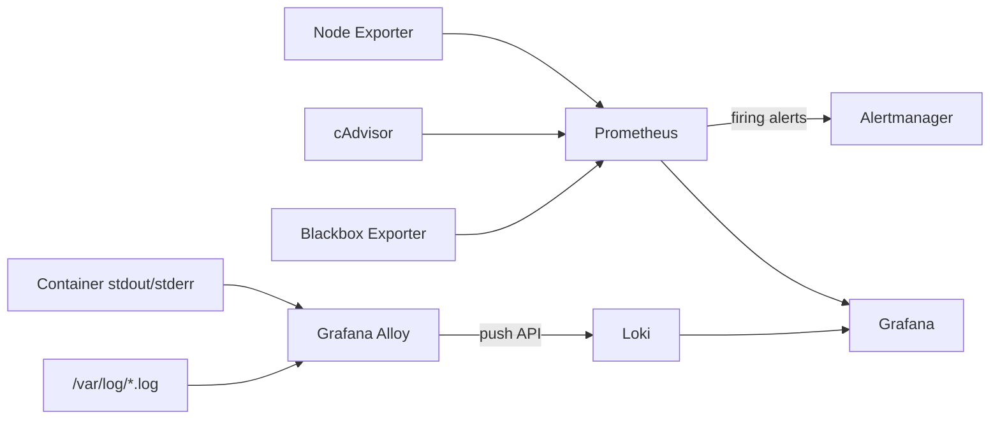

# Monitoring Lab: Prometheus, Grafana, Loki, and Alertmanager

## What You'll Learn

- How to build a complete local observability stack from a handful of config files
- How metrics, logs, alerts, and synthetic probes flow between the services
- How to verify each component and where its configuration lives

Every file you need is on this page. Create them in an empty directory, run one command, and you have a working stack to use with the rest of this section.

## What the Stack Includes

| Service | Role | Local URL |
|---|---|---|
| Prometheus | Scrapes metrics, stores time series, evaluates alert rules | `http://localhost:9090` |
| Alertmanager | Groups, routes, and silences alerts | `http://localhost:9093` |
| Grafana | Dashboards and log exploration | `http://localhost:3000` |
| Node Exporter | Host CPU, memory, disk, and network metrics | `http://localhost:9100/metrics` |
| cAdvisor | Per-container resource metrics | `http://localhost:8080` |
| Blackbox Exporter | Synthetic HTTP and TCP probes | `http://localhost:9115` |
| Loki | Log storage and LogQL queries | `http://localhost:3100/ready` |
| Grafana Alloy | Collects container and host logs, pushes to Loki | `http://localhost:12345` |

## Signal Flow



Use the signal that best answers the question: metrics show *how much* and *when*; logs show the detailed record; synthetic probes show whether something can actually be reached. Traces are covered in [OpenTelemetry and Other Platforms](opentelemetry-platforms.md).

## Prerequisites

- Docker Engine with the Compose plugin (Docker Desktop, OrbStack, or Colima also work)
- About 2 GB of free memory
- Internet access to pull images the first time

```bash
docker --version
docker compose version
```

!!! note "Linux host recommended"
    Node Exporter and cAdvisor read host metrics. On macOS and Windows they see the Docker VM, not your laptop, and cAdvisor may show fewer container details. Everything still starts, and the lab is fully usable for learning.

## Project Layout

```text
monitoring-lab/
├── .env
├── docker-compose.yml
├── prometheus/
│   ├── prometheus.yml
│   └── rules/
│       └── alerts.yml
├── alertmanager/
│   └── alertmanager.yml
├── blackbox/
│   └── blackbox.yml
├── loki/
│   └── loki-config.yml
├── alloy/
│   └── config.alloy
└── grafana/
    ├── dashboards/
    │   └── node-exporter-full.json
    └── provisioning/
        ├── dashboards/
        │   └── dashboards.yml
        └── datasources/
            └── datasources.yml
```

```bash
mkdir -p monitoring-lab && cd monitoring-lab
mkdir -p prometheus/rules alertmanager blackbox loki alloy \
  grafana/dashboards grafana/provisioning/dashboards grafana/provisioning/datasources
```

## Build the Lab

### 1. Compose file and Grafana password

Set the Grafana admin password in `.env` instead of relying on the `admin`/`admin` default:

```bash title=".env"
GRAFANA_ADMIN_PASSWORD=change-me-to-something-long
```

```yaml title="docker-compose.yml"
services:
  prometheus:
    image: prom/prometheus:v3.14.0
    command:
      - --config.file=/etc/prometheus/prometheus.yml
      - --storage.tsdb.path=/prometheus
      - --storage.tsdb.retention.time=7d
      - --web.enable-lifecycle          # allows POST /-/reload after config edits
    volumes:
      - ./prometheus:/etc/prometheus:ro
      - prometheus_data:/prometheus
    ports:
      - "127.0.0.1:9090:9090"
    restart: unless-stopped

  alertmanager:
    image: prom/alertmanager:v0.34.0
    command:
      - --config.file=/etc/alertmanager/alertmanager.yml
      - --storage.path=/alertmanager
    volumes:
      - ./alertmanager:/etc/alertmanager:ro
      - alertmanager_data:/alertmanager
    ports:
      - "127.0.0.1:9093:9093"
    restart: unless-stopped

  node-exporter:
    image: prom/node-exporter:v1.12.1
    command:
      - --path.rootfs=/host
    pid: host
    volumes:
      - /:/host:ro,rslave
    ports:
      - "127.0.0.1:9100:9100"
    restart: unless-stopped

  cadvisor:
    image: ghcr.io/google/cadvisor:v0.60.5
    privileged: true
    devices:
      - /dev/kmsg
    volumes:
      - /:/rootfs:ro
      - /var/run:/var/run:ro
      - /sys:/sys:ro
      - /var/lib/docker/:/var/lib/docker:ro
    ports:
      - "127.0.0.1:8080:8080"
    restart: unless-stopped

  blackbox:
    image: prom/blackbox-exporter:v0.28.0
    command:
      - --config.file=/etc/blackbox/blackbox.yml
    volumes:
      - ./blackbox:/etc/blackbox:ro
    ports:
      - "127.0.0.1:9115:9115"
    restart: unless-stopped

  loki:
    image: grafana/loki:3.7.7
    command:
      - -config.file=/etc/loki/loki-config.yml
    volumes:
      - ./loki:/etc/loki:ro
      - loki_data:/loki
    ports:
      - "127.0.0.1:3100:3100"
    restart: unless-stopped

  alloy:
    image: grafana/alloy:v1.19.2
    command:
      - run
      - --server.http.listen-addr=0.0.0.0:12345
      - --storage.path=/var/lib/alloy/data
      - /etc/alloy/config.alloy
    volumes:
      - ./alloy/config.alloy:/etc/alloy/config.alloy:ro
      - /var/run/docker.sock:/var/run/docker.sock:ro
      - /var/log:/var/log:ro
      - alloy_data:/var/lib/alloy/data
    ports:
      - "127.0.0.1:12345:12345"
    depends_on:
      - loki
    restart: unless-stopped

  grafana:
    image: grafana/grafana:13.2.1
    environment:
      GF_SECURITY_ADMIN_USER: admin
      GF_SECURITY_ADMIN_PASSWORD: ${GRAFANA_ADMIN_PASSWORD:?set GRAFANA_ADMIN_PASSWORD in .env}
      GF_USERS_ALLOW_SIGN_UP: "false"
    volumes:
      - ./grafana/provisioning:/etc/grafana/provisioning:ro
      - ./grafana/dashboards:/var/lib/grafana/dashboards:ro
      - grafana_data:/var/lib/grafana
    ports:
      - "127.0.0.1:3000:3000"
    depends_on:
      - prometheus
      - loki
    restart: unless-stopped

volumes:
  prometheus_data:
  alertmanager_data:
  loki_data:
  alloy_data:
  grafana_data:
```

Every port is bound to `127.0.0.1`, so the lab is reachable from your machine only — not from the rest of the network.

### 2. Grafana

Provision data sources so Grafana is ready the moment it starts:

```yaml title="grafana/provisioning/datasources/datasources.yml"
apiVersion: 1

datasources:
  - name: Prometheus
    uid: prometheus
    type: prometheus
    access: proxy
    url: http://prometheus:9090
    isDefault: true

  - name: Loki
    uid: loki
    type: loki
    access: proxy
    url: http://loki:3100
```

Load every JSON file in `grafana/dashboards/` as a dashboard:

```yaml title="grafana/provisioning/dashboards/dashboards.yml"
apiVersion: 1

providers:
  - name: lab-dashboards
    folder: Monitoring Lab
    type: file
    allowUiUpdates: true
    options:
      path: /var/lib/grafana/dashboards
```

Download the community **Node Exporter Full** dashboard. It selects the Prometheus data source through a dashboard variable, so it works with the provisioned data source as-is:

```bash
curl -sL -o grafana/dashboards/node-exporter-full.json \
  https://grafana.com/api/dashboards/1860/revisions/latest/download
```

### 3. Prometheus and alert rules

```yaml title="prometheus/prometheus.yml"
global:
  scrape_interval: 15s
  evaluation_interval: 15s

alerting:
  alertmanagers:
    - static_configs:
        - targets: ["alertmanager:9093"]

rule_files:
  - /etc/prometheus/rules/*.yml

scrape_configs:
  - job_name: prometheus
    static_configs:
      - targets: ["localhost:9090"]

  - job_name: alertmanager
    static_configs:
      - targets: ["alertmanager:9093"]

  - job_name: node
    static_configs:
      - targets: ["node-exporter:9100"]

  - job_name: cadvisor
    static_configs:
      - targets: ["cadvisor:8080"]

  - job_name: loki
    static_configs:
      - targets: ["loki:3100"]

  - job_name: alloy
    static_configs:
      - targets: ["alloy:12345"]

  # Synthetic checks: Prometheus asks Blackbox Exporter to probe each URL
  - job_name: blackbox-http
    metrics_path: /probe
    params:
      module: [http_2xx]
    static_configs:
      - targets:
          - http://grafana:3000/api/health
          - http://prometheus:9090/-/healthy
          - http://alertmanager:9093/-/healthy
          - http://loki:3100/ready
    relabel_configs:
      - source_labels: [__address__]
        target_label: __param_target
      - source_labels: [__param_target]
        target_label: instance
      - target_label: __address__
        replacement: blackbox:9115
```

```yaml title="prometheus/rules/alerts.yml"
groups:
  - name: lab-alerts
    rules:
      - alert: TargetDown
        expr: up == 0
        for: 1m
        labels:
          severity: critical
        annotations:
          summary: "{{ $labels.job }} target {{ $labels.instance }} is down"
          description: "Prometheus has failed to scrape this target for more than 1 minute."

      - alert: HostHighCPU
        expr: 100 * (1 - avg by (instance) (rate(node_cpu_seconds_total{job="node",mode="idle"}[5m]))) > 80
        for: 5m
        labels:
          severity: warning
        annotations:
          summary: "CPU above 80% on {{ $labels.instance }}"

      - alert: HostHighMemory
        expr: 100 * (1 - node_memory_MemAvailable_bytes{job="node"} / node_memory_MemTotal_bytes{job="node"}) > 85
        for: 5m
        labels:
          severity: warning
        annotations:
          summary: "Memory above 85% on {{ $labels.instance }}"

      - alert: HostDiskAlmostFull
        expr: 100 * node_filesystem_avail_bytes{job="node",fstype!~"tmpfs|overlay"} / node_filesystem_size_bytes{job="node",fstype!~"tmpfs|overlay"} < 10
        for: 10m
        labels:
          severity: warning
        annotations:
          summary: "Less than 10% disk free on {{ $labels.instance }} {{ $labels.mountpoint }}"

      - alert: ContainerHighCPU
        expr: sum by (name) (rate(container_cpu_usage_seconds_total{name!=""}[5m])) > 0.8
        for: 5m
        labels:
          severity: warning
        annotations:
          summary: "Container {{ $labels.name }} is using more than 0.8 CPU cores"

      - alert: ContainerHighMemory
        expr: container_memory_working_set_bytes{name!=""} > 512 * 1024 * 1024
        for: 5m
        labels:
          severity: warning
        annotations:
          summary: "Container {{ $labels.name }} is using more than 512 MiB"

      - alert: SyntheticProbeFailed
        expr: probe_success{job="blackbox-http"} == 0
        for: 2m
        labels:
          severity: critical
        annotations:
          summary: "Probe failed for {{ $labels.instance }}"
```

### 4. Alertmanager

The default receiver discards notifications, which is fine for a lab — you watch alerts in the Alertmanager UI. Uncomment the webhook to send them somewhere real.

```yaml title="alertmanager/alertmanager.yml"
route:
  receiver: default
  group_by: [alertname, job]
  group_wait: 30s
  group_interval: 5m
  repeat_interval: 4h
  routes:
    - matchers: [severity="critical"]
      receiver: default
      group_wait: 10s

receivers:
  - name: default
    # webhook_configs:
    #   - url: http://your-webhook-receiver:5001/alerts

inhibit_rules:
  # A critical alert silences warnings for the same alert and instance
  - source_matchers: [severity="critical"]
    target_matchers: [severity="warning"]
    equal: [alertname, instance]
```

### 5. Blackbox Exporter

```yaml title="blackbox/blackbox.yml"
modules:
  http_2xx:
    prober: http
    timeout: 5s
    http:
      preferred_ip_protocol: ip4
      valid_status_codes: []   # empty means any 2xx

  tcp_connect:
    prober: tcp
    timeout: 5s
```

### 6. Loki

```yaml title="loki/loki-config.yml"
auth_enabled: false

server:
  http_listen_port: 3100

common:
  path_prefix: /loki
  replication_factor: 1
  ring:
    kvstore:
      store: inmemory
  storage:
    filesystem:
      chunks_directory: /loki/chunks
      rules_directory: /loki/rules

schema_config:
  configs:
    - from: 2024-01-01
      store: tsdb
      object_store: filesystem
      schema: v13
      index:
        prefix: index_
        period: 24h

limits_config:
  retention_period: 168h        # keep 7 days of logs

compactor:
  working_directory: /loki/compactor
  retention_enabled: true
  delete_request_store: filesystem

analytics:
  reporting_enabled: false
```

### 7. Grafana Alloy

```alloy title="alloy/config.alloy"
// Discover running Docker containers
discovery.docker "containers" {
  host = "unix:///var/run/docker.sock"
}

// Turn the "/prometheus-1" container name into a clean "container" label
discovery.relabel "containers" {
  targets = []

  rule {
    source_labels = ["__meta_docker_container_name"]
    regex         = "/(.*)"
    target_label  = "container"
  }
}

loki.source.docker "containers" {
  host          = "unix:///var/run/docker.sock"
  targets       = discovery.docker.containers.targets
  relabel_rules = discovery.relabel.containers.rules
  forward_to    = [loki.write.local.receiver]
}

// Host log files
local.file_match "system" {
  path_targets = [{"__path__" = "/var/log/*.log", "job" = "varlogs"}]
}

loki.source.file "system" {
  targets    = local.file_match.system.targets
  forward_to = [loki.write.local.receiver]
}

loki.write "local" {
  endpoint {
    url = "http://loki:3100/loki/api/v1/push"
  }
}
```

[Loki Logging With Grafana Alloy](logging.md) explains each block and how to choose labels.

## Start the Stack

```bash
docker compose config --quiet && echo "compose file OK"
docker compose up -d
docker compose ps
```

All eight services should show `running`. Give Grafana and Loki 20–30 seconds on the first start.

## Verify Each Component

```bash
curl -s localhost:9090/-/healthy            # Prometheus Server is Healthy.
curl -s localhost:9093/-/healthy            # OK
curl -s localhost:3100/ready                # ready
curl -s localhost:3000/api/health           # "database": "ok"
curl -s localhost:9100/metrics | head -3    # node_ metrics
curl -s 'localhost:9115/probe?target=http://prometheus:9090/-/healthy&module=http_2xx' | grep probe_success

# Every scrape target and its health
curl -s localhost:9090/api/v1/targets | grep -o '"health":"[a-z]*"' | sort | uniq -c
```

Then in the browser:

1. **Prometheus → Status → Target health** — every target `UP`.
2. **Prometheus → Alerts** — rules loaded and `inactive`.
3. **Grafana → Dashboards → Monitoring Lab → Node Exporter Full** — panels populated. Log in as `admin` with the password from `.env`.
4. **Grafana → Explore → Loki** — run `{container=~".+"}` and see container logs arriving.
5. **Alloy UI at `localhost:12345`** — every component healthy.

## Trigger a Test Alert

Stop a service and watch the alert move from `pending` to `firing`:

```bash
docker compose stop loki
# After about 1 minute: TargetDown fires in Prometheus → Alerts and appears in Alertmanager
# After about 2 minutes: SyntheticProbeFailed fires for http://loki:3100/ready
docker compose start loki
```

## Reload Configuration

```bash
# Prometheus: validate, then hot-reload without a restart
docker compose exec prometheus promtool check config /etc/prometheus/prometheus.yml
curl -X POST localhost:9090/-/reload

# Alertmanager
docker compose exec alertmanager amtool check-config /etc/alertmanager/alertmanager.yml
curl -X POST localhost:9093/-/reload

# Anything else
docker compose restart loki alloy grafana
```

## Clean Up

```bash
docker compose down        # stop and remove containers, keep data
docker compose down -v     # also delete metrics, logs, and dashboard data
```

## Common Mistakes

- Leaving Grafana's default `admin`/`admin` login — the Compose file refuses to start without a password in `.env` for that reason.
- Publishing ports on `0.0.0.0` on a cloud VM, exposing unauthenticated Prometheus, Loki, and Alertmanager APIs to the internet.
- Running without named volumes and losing dashboards and history on every recreate.
- Using `latest` image tags, so the lab silently changes behavior months later. Upgrade the pinned tags on purpose.
- Granting cAdvisor and Node Exporter host access on a shared machine without thinking about what they can read.

## Interview Questions

- How does data get from a container to a Grafana panel in this stack, for both metrics and logs?
- Which components store data, and which only process or display it?
- Why does the Blackbox job rewrite `__address__` to the exporter while keeping the probed URL as `instance`?
- How would you verify the stack is healthy after starting it?

## Next

Continue to [Prometheus](prometheus.md).
