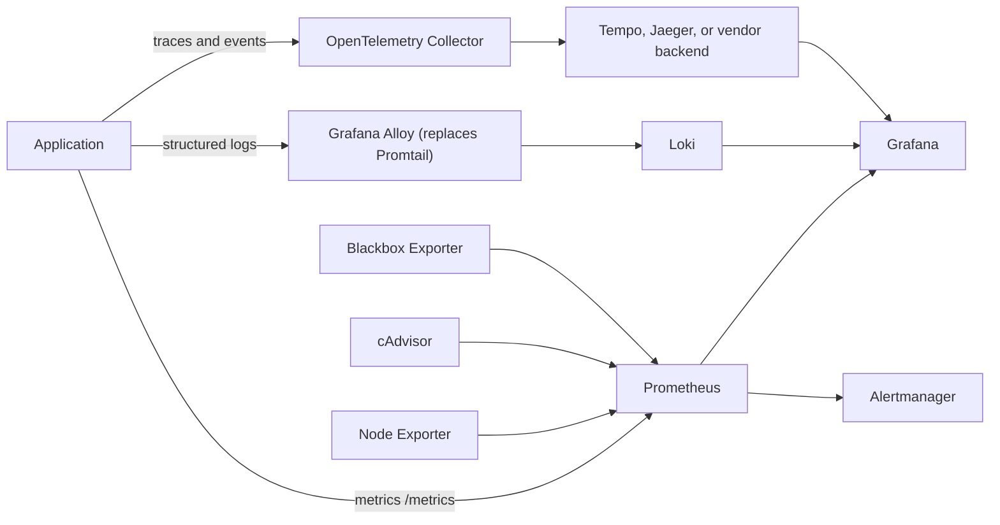

# Monitoring Stack Walkthrough: Prometheus, Grafana, Loki, and Alertmanager

## What You'll Learn

- What the lab repository runs, and how signals flow between services
- How to start the stack and verify each service
- Where each component's configuration lives

This page explains how the monitoring lab is structured and how to bring it up quickly.

Repository: [sameeralam3127/Monitoring](https://github.com/sameeralam3127/Monitoring)

## What the Stack Includes

- Prometheus for scraping metrics and evaluating alerts
- Grafana for dashboards and visualization
- Alertmanager for notification routing
- Node Exporter and cAdvisor for infrastructure and container metrics
- Loki for log storage, with Promtail as the lab's collector (Promtail is end-of-life — see [Loki logging with Grafana Alloy](logging.md) for the supported replacement)
- Blackbox Exporter for synthetic endpoint checks

## Signal Flow



Use the signal that best answers the question: metrics show *how much* and *when*; logs show the detailed record; traces show *where* time or errors occur across a request; events record meaningful state changes such as a deployment or failed payment.

## Why This Repo Is Practical

It shows how the main observability tools fit together instead of teaching them as isolated demos.

## Prerequisites

- Docker
- `docker compose`
- Internet access for the first image build

Quick check:

```bash
docker --version
docker compose version
```

## Start the Stack

```bash
git clone https://github.com/sameeralam3127/Monitoring.git
cd Monitoring
docker compose up -d --build
```

## Verify the Services

```bash
docker compose ps
```

Open these services locally:

- Grafana: `http://localhost:3000`
- Prometheus: `http://localhost:9090`
- Alertmanager: `http://localhost:9093`
- cAdvisor: `http://localhost:8080`
- Blackbox Exporter: `http://localhost:9115`

Grafana default login:

- Username: `admin`
- Password: `admin`

## Key Configuration Paths

- `prometheus/prometheus.yml`
- `prometheus/rules/alerts.yml`
- `grafana/provisioning/`
- `alertmanager/`
- `loki/`
- `promtail/` (legacy collector — migrate to `alloy/config.alloy`)
- `blackbox/blackbox.yml`

## Practical Next Steps

After the stack is up:

1. Confirm Prometheus targets are healthy.
2. Check that Grafana data sources load automatically.
3. Verify logs appear in Loki.
4. Confirm synthetic probes return results.

## Common Mistakes

- Leaving Grafana's default `admin`/`admin` login in place.
- Running the lab on a server with every port published to the internet.
- Running without persistent volumes and losing dashboards and history on restart.
- Forgetting that cAdvisor and Node Exporter need host access, and granting it on shared machines without thinking.

## Interview Questions

- How does data get from an application to a Grafana panel in this stack?
- Which components store data, and which only process or display it?
- How would you verify the stack is healthy after starting it?

## Next

Continue to [Prometheus](prometheus.md).
