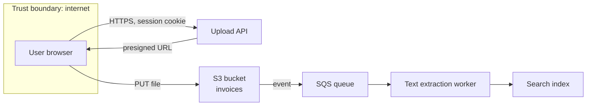

# DevSecOps and Threat Modeling

## What You'll Learn

- What DevSecOps changes about who owns security and when it happens
- Which automated controls belong at each stage of delivery
- How to run a lightweight threat model with STRIDE, using a worked example
- How to secure CI/CD pipelines, which are high-value targets in their own right

## What DevSecOps Means

Traditional security reviewed a finished system just before release: slow, adversarial, and too late to change the design. DevSecOps makes security a **shared responsibility** built into everyday engineering:

- **Security requirements and threat models** happen during design, when changes are cheap.
- **Automated checks** run on every commit and build, giving developers feedback in minutes.
- **Guardrails over gates**: secure defaults and paved roads make the safe path the easy path.
- **Security teams** build tooling, set policy, coach, and handle the hard problems — they don't manually review every change.

## Controls by Stage

| Stage | Control | Example tools |
|---|---|---|
| **Design** | Threat modeling, security requirements | STRIDE sessions, OWASP ASVS as a checklist |
| **Code** | Secret scanning, SAST, secure code review | Gitleaks, Semgrep, CodeQL, IDE plugins |
| **Dependencies** | Software composition analysis, license checks, automated updates | Dependabot, Renovate, Trivy, Grype, OSV-Scanner |
| **Build** | Image scanning, SBOM generation, signing, provenance | Trivy, Syft, Cosign, GitHub artifact attestations |
| **Infrastructure as code** | Misconfiguration scanning, policy as code | Checkov, Trivy config, Conftest (OPA) |
| **Deploy** | Admission control, signature verification | Kyverno, OPA Gatekeeper, cloud-native policy |
| **Test** | Dynamic testing against running apps | ZAP, API fuzzers |
| **Run** | Runtime detection, audit logging, vulnerability monitoring, patching | Falco, GuardDuty, CloudTrail, Inspector |

Start with the controls that catch the most common real incidents — leaked secrets, known-vulnerable dependencies, and cloud misconfigurations — before investing in the rest. See [Code Quality: Open-Source Tools](../cicd/code-quality/code-quality-ecosystem.md) for SAST and SCA setup.

## Shift Left, and Shift Right

- **Shift left** means catching issues earlier, where they're cheaper to fix.
- **Shift right** means assuming some issues will reach production anyway, and detecting and containing them there: runtime monitoring, anomaly detection, least privilege that limits the blast radius, and practiced incident response.

You need both. No pipeline catches everything, and zero-day vulnerabilities in dependencies appear after you ship.

## Threat Modeling

A threat model answers four questions (from the Threat Modeling Manifesto):

1. **What are we working on?**
2. **What can go wrong?**
3. **What are we going to do about it?**
4. **Did we do a good enough job?**

It doesn't need to be a big formal exercise. An hour with the team, a diagram, and a list is enough for most features. Do it when designing a new service, adding a new trust boundary (a public endpoint, a third-party integration), or handling a new kind of sensitive data.

### STRIDE

STRIDE is a checklist for question two:

| Threat | Violates | Question to ask | Typical mitigations |
|---|---|---|---|
| **S**poofing | Authentication | Can someone pretend to be a user or service? | Strong authentication, MFA, mTLS, signed tokens |
| **T**ampering | Integrity | Can data or code be modified in transit or at rest? | TLS, signing, checksums, write-restricted storage |
| **R**epudiation | Non-repudiation | Can someone deny doing something because there's no record? | Audit logs that users can't alter |
| **I**nformation disclosure | Confidentiality | Can data leak to someone who shouldn't see it? | Encryption, least privilege, redaction in logs |
| **D**enial of service | Availability | Can someone exhaust resources or take it down? | Rate limits, quotas, autoscaling, WAF |
| **E**levation of privilege | Authorization | Can someone gain permissions they shouldn't have? | Authorization checks on every request, least privilege, sandboxing |

## Worked Example: A File Upload Feature

**What are we working on?** Users upload invoices (PDFs) through the web app. An API stores them in S3, and a worker extracts text for search.



**What can go wrong?** Walking each element and data flow through STRIDE:

| # | Element | STRIDE | Threat | Risk |
|---|---|---|---|---|
| 1 | Presigned URL | Spoofing / Elevation | A URL for one user's upload key is reused to overwrite another user's files | High |
| 2 | Uploaded file | Tampering / Elevation | A malicious PDF exploits a parser vulnerability in the worker | High |
| 3 | S3 bucket | Information disclosure | Bucket or objects become publicly readable | High |
| 4 | Upload API | Denial of service | Unlimited uploads fill storage and run up costs | Medium |
| 5 | Worker | Information disclosure | Extracted invoice text, including personal data, is written to logs | Medium |
| 6 | Search index | Elevation | Search results return other tenants' invoices | High |
| 7 | All | Repudiation | No record of who uploaded or deleted a file | Low |

**What are we going to do about it?**

| # | Mitigation | Ticket |
|---|---|---|
| 1 | Presigned URLs are generated per upload for a server-chosen key under the user's tenant prefix, expire in 5 minutes, and restrict content type and size | SEC-101 |
| 2 | Worker runs as non-root in a sandboxed container with no network egress except SQS and the index; parser library pinned and monitored for CVEs; file type validated by content, not extension | SEC-102 |
| 3 | Account-level Block Public Access, bucket policy denying non-TLS access and principals outside the organization, SSE-KMS | SEC-103 |
| 4 | Per-user rate limit and quota; S3 lifecycle for abandoned uploads; budget alert | SEC-104 |
| 5 | Structured logging with an allow-list of fields; no document content in logs | SEC-105 |
| 6 | Tenant ID enforced by the search query layer, never taken from client input; integration test for cross-tenant access | SEC-106 |
| 7 | CloudTrail S3 data events for the bucket; application audit log for uploads and deletes | SEC-107 |

**Did we do a good enough job?** Review the model when the design changes, and check that each mitigation has a test or a monitored control — not just a ticket that was closed.

## Securing the CI/CD Pipeline

Pipelines hold credentials to production and can change what gets deployed, so attackers target them directly. Common attacks:

| Attack | How it works |
|---|---|
| **Poisoned pipeline execution** | A pull request modifies the workflow or build scripts to exfiltrate secrets |
| **Compromised third-party action or plugin** | A popular action's tag is repointed to malicious code |
| **Dependency confusion** | A public package with the same name as an internal one is installed instead |
| **Stolen long-lived credentials** | Cloud keys stored as CI secrets are extracted and reused |
| **Unprotected release process** | Anyone with write access can push a tag that deploys to production |

### Hardening checklist for GitHub Actions

```yaml title=".github/workflows/build.yml (hardened excerpt)"
on:
  pull_request:          # not pull_request_target for untrusted code
  push:
    branches: [main]

permissions:
  contents: read         # default least privilege; grant more per job

jobs:
  build:
    runs-on: ubuntu-latest
    steps:
      # Pin third-party actions to a full commit SHA; keep the version as a comment
      - uses: actions/checkout@3d3c42e5aac5ba805825da76410c181273ba90b1 # v7.0.1
        with:
          persist-credentials: false

      - name: Build
        run: make build

  deploy:
    needs: build
    if: github.ref == 'refs/heads/main'
    runs-on: ubuntu-latest
    environment: production        # required reviewers and branch restrictions
    permissions:
      contents: read
      id-token: write              # OIDC to the cloud, no stored keys
    steps:
      - run: echo "deploy with short-lived credentials"
```

- **Least-privilege `GITHUB_TOKEN`** with `permissions:` at the workflow and job level.
- **Never run untrusted code with secrets.** `pull_request_target` and `workflow_run` run with repository secrets; don't check out and execute pull request code in them.
- **Pin actions to commit SHAs**, and let Dependabot or Renovate update them. Tags can be moved; SHAs can't.
- **Use OIDC federation** instead of stored cloud credentials — see [AWS OIDC roles](../cloud/aws/02-iam.md#oidc-roles-for-cicd).
- **Protect production** with environments, required reviewers, and branch or tag restrictions.
- **Treat workflow files as sensitive code** — require code owner review for `.github/workflows/`.
- **Isolate self-hosted runners**: ephemeral runners, never shared between public and private repositories.
- **Audit with [OpenSSF Scorecard](https://securityscorecards.dev/)**, which checks branch protection, pinned dependencies, token permissions, and more.

## Common Mistakes

- Treating security as a final approval gate instead of automated feedback throughout delivery.
- Turning on every scanner at once with blocking thresholds, flooding teams with findings they learn to ignore.
- Threat models written once for compliance and never updated when the design changes.
- Mitigations tracked as tickets without a test or monitored control proving they work.
- Workflows with default write permissions, unpinned third-party actions, and long-lived cloud keys in secrets.
- Running pull request code from forks in `pull_request_target` workflows with access to secrets.

## Interview Questions

- What does "shift left" mean, and why isn't it enough on its own?
- Walk through STRIDE and give an example threat for each category.
- Threat model a feature that lets users upload files. What are the top risks?
- How would you harden a GitHub Actions pipeline that deploys to production?
- What is poisoned pipeline execution, and how do you prevent it?

## Next

Continue to [Secrets Management With Vault](02-secrets-management-with-vault.md).
