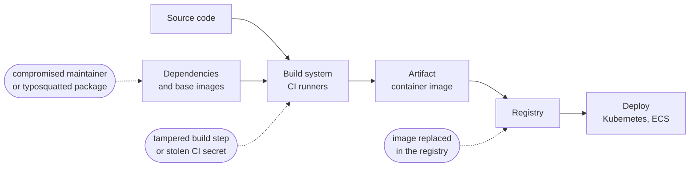

# Software Supply Chain Security

## What You'll Learn

- What the software supply chain is, and how real attacks have exploited it
- How to generate and use SBOMs
- How to sign container images keylessly with Sigstore Cosign, and verify them
- What build provenance and SLSA are, and how to produce provenance in CI
- How to keep dependencies up to date and trustworthy

## The Supply Chain

Everything that goes into the software you run is part of its supply chain: your code, open-source dependencies, base images, build tools, CI systems, registries, and the deployment path.



Well-known incidents show every link can be attacked: a compromised build system inserting a backdoor into signed updates (SolarWinds), a maliciously modified build script exfiltrating CI secrets (Codecov), a long-running social-engineering campaign to backdoor a compression library used by SSH (xz utils), and typosquatted packages on npm and PyPI.

The defenses answer three questions:

| Question | Control |
|---|---|
| **What's inside this artifact?** | SBOM |
| **Who built it, and has it changed since?** | Signature |
| **How, where, and from which source was it built?** | Provenance attestation |

## SBOMs

A **software bill of materials** lists every component in an artifact, with versions and identifiers. When the next critical vulnerability is announced in a widely used library, an SBOM inventory answers "where are we affected?" in minutes instead of days.

Two standard formats:

| Format | Maintained by | Notes |
|---|---|---|
| **SPDX** | Linux Foundation | ISO standard; strong license detail |
| **CycloneDX** | OWASP | Security focused; supports VEX statements |

### Generate and scan an SBOM

```bash
# Generate with Syft
syft ghcr.io/acme/orders-api:3f9c2d1 -o cyclonedx-json=sbom.cdx.json
syft dir:. -o spdx-json=sbom.spdx.json          # from a source directory

# Scan the SBOM for known vulnerabilities later, without re-pulling the image
grype sbom:sbom.cdx.json --fail-on high
trivy sbom sbom.cdx.json --severity HIGH,CRITICAL
```

Store SBOMs with the artifact — as a registry attestation or in an SBOM platform such as Dependency-Track — so you can query them across every image you've shipped.

## Signing Images With Sigstore Cosign

Signing proves an image was produced by a trusted identity and hasn't been modified. **Keyless signing** with Sigstore avoids managing long-lived signing keys:

1. In CI, Cosign gets the workflow's OIDC identity token.
2. **Fulcio**, Sigstore's certificate authority, issues a short-lived certificate for that identity (for example, a specific GitHub workflow in a specific repository).
3. Cosign signs the image **digest** and records the signature in **Rekor**, a public transparency log.
4. Verifiers check the signature, the certificate identity, and the transparency log entry.

```yaml title=".github/workflows/release.yml"
name: Release image
on:
  push:
    tags: ["v*"]

permissions:
  contents: read

jobs:
  build-sign:
    runs-on: ubuntu-latest
    permissions:
      contents: read
      packages: write          # push to GHCR
      id-token: write          # OIDC for keyless signing and attestations
      attestations: write
    steps:
      - uses: actions/checkout@v7

      - uses: docker/login-action@v4
        with:
          registry: ghcr.io
          username: ${{ github.actor }}
          password: ${{ secrets.GITHUB_TOKEN }}

      - uses: docker/setup-buildx-action@v4

      - name: Build and push
        id: build
        uses: docker/build-push-action@v7
        with:
          push: true
          tags: ghcr.io/${{ github.repository }}:${{ github.ref_name }}

      - uses: sigstore/cosign-installer@v4.1.2

      - name: Sign the image by digest (keyless)
        env:
          IMAGE: ghcr.io/${{ github.repository }}@${{ steps.build.outputs.digest }}
        run: cosign sign --yes "$IMAGE"

      - name: Generate SBOM
        uses: anchore/sbom-action@v0
        with:
          image: ghcr.io/${{ github.repository }}@${{ steps.build.outputs.digest }}
          format: cyclonedx-json
          output-file: sbom.cdx.json

      - name: Attach SBOM as a signed attestation
        env:
          IMAGE: ghcr.io/${{ github.repository }}@${{ steps.build.outputs.digest }}
        run: cosign attest --yes --type cyclonedx --predicate sbom.cdx.json "$IMAGE"

      - name: Build provenance attestation
        uses: actions/attest-build-provenance@v4
        with:
          subject-name: ghcr.io/${{ github.repository }}
          subject-digest: ${{ steps.build.outputs.digest }}
          push-to-registry: true
```

**Always sign by digest**, never by tag — a tag can be moved to a different image after signing.

### Verify a signature

```bash
cosign verify ghcr.io/acme/orders-api@sha256:4b1d9f... \
  --certificate-identity-regexp '^https://github\.com/acme/orders-api/\.github/workflows/release\.yml@refs/tags/v' \
  --certificate-oidc-issuer https://token.actions.githubusercontent.com
```

Verifying only that "some valid signature exists" is not enough — anyone can sign an image with their own identity. Always pin the **expected identity and issuer**.

## Build Provenance and SLSA

A **provenance attestation** records how an artifact was built: the source repository and commit, the build workflow, the builder, and the inputs. It lets you verify that a production image was built by your official pipeline from a reviewed commit — not on someone's laptop.

```bash
# Verify GitHub artifact attestations
gh attestation verify oci://ghcr.io/acme/orders-api@sha256:4b1d9f... --owner acme
```

**SLSA** (Supply-chain Levels for Software Artifacts) is a framework describing increasing levels of build integrity. Its build track levels, roughly:

| Level | Requirement |
|---|---|
| Build L1 | Provenance exists, describing how the artifact was built |
| Build L2 | Built on a hosted build platform that generates and signs provenance |
| Build L3 | The build platform is hardened so builds can't influence each other or tamper with provenance and secrets |

Hosted CI with isolated, ephemeral runners and platform-generated attestations (such as GitHub artifact attestations with GitHub-hosted runners) gets you most of the way to Build L3. The practical goal is simple: **every production artifact has verifiable provenance pointing to a reviewed commit and your official pipeline**.

## Enforce at Deploy Time

Signing is only useful if something checks it. In Kubernetes, verify signatures and attestations with an admission controller:

```yaml title="kyverno-verify-images.yaml"
apiVersion: kyverno.io/v1
kind: ClusterPolicy
metadata:
  name: verify-acme-images
spec:
  validationFailureAction: Enforce
  webhookTimeoutSeconds: 30
  rules:
    - name: require-signed-by-release-workflow
      match:
        any:
          - resources:
              kinds: [Pod]
      verifyImages:
        - imageReferences:
            - "ghcr.io/acme/*"
          mutateDigest: true          # rewrite tags to the verified digest
          attestors:
            - entries:
                - keyless:
                    subject: "https://github.com/acme/*/.github/workflows/release.yml@refs/tags/*"
                    issuer: "https://token.actions.githubusercontent.com"
                    rekor:
                      url: https://rekor.sigstore.dev
```

Roll out in `Audit` mode first, fix unsigned workloads, then switch to `Enforce`. See [Image and Supply Chain Security](../kubernetes/security/05-image-and-supply-chain-security.md) for more on admission policy.

## Dependency Hygiene

| Practice | How |
|---|---|
| **Lock and pin** | Commit lock files (`uv.lock`, `package-lock.json`, `go.sum`); pin base images by digest; pin CI actions by SHA |
| **Update continuously** | Dependabot or Renovate with grouped, automerged patch updates when tests pass |
| **Scan for known vulnerabilities** | SCA in every pull request and a scheduled scan of what's deployed |
| **Prefer minimal base images** | Distroless, Chainguard, or `-slim` images have fewer components to patch |
| **Check package trust** | Watch for typosquats, brand-new packages, and install scripts; use an internal proxy or registry |
| **Prevent dependency confusion** | Scope internal packages (`@acme/…`), configure registries so internal names never resolve publicly |
| **Assess project health** | OpenSSF Scorecard for maintenance, branch protection, and signed releases of key dependencies |

```json title="renovate.json"
{
  "$schema": "https://docs.renovatebot.com/renovate-schema.json",
  "extends": ["config:recommended", "helpers:pinGitHubActionDigests"],
  "packageRules": [
    {
      "matchUpdateTypes": ["patch", "minor"],
      "matchCurrentVersion": "!/^0/",
      "groupName": "non-major dependencies",
      "automerge": true
    }
  ],
  "vulnerabilityAlerts": { "labels": ["security"], "automerge": true }
}
```

## Common Mistakes

- Signing images by tag, or signing but never verifying at deploy time.
- Verifying that a signature exists without checking **whose** identity signed it.
- Generating SBOMs as a compliance artifact that nobody stores or queries.
- Base images pulled as `:latest` and CI actions referenced by movable tags.
- Dependency updates batched quarterly, turning each upgrade into a risky project.
- Internal package names that could be claimed on public registries.
- Treating supply chain security as only a scanning problem, while CI runners hold long-lived production credentials.

## Interview Questions

- What is an SBOM, and how does it help when a new critical vulnerability is announced?
- How does Sigstore keyless signing work? What are Fulcio and Rekor?
- Why sign by digest instead of by tag?
- What is build provenance, and what does SLSA describe?
- How would you ensure only images built by your release pipeline run in production Kubernetes?

## Next

Continue to [Container and IaC Scanning](04-container-and-iac-scanning.md).
