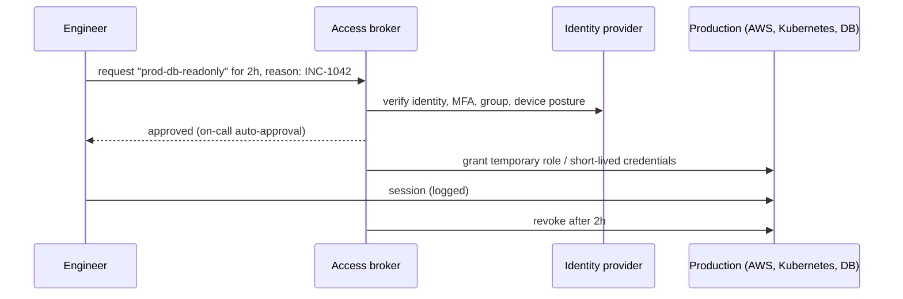

# Identity and Zero Trust

## What You'll Learn

- What zero trust means, and why "inside the network" is no longer a safe assumption
- How to secure human access with SSO, phishing-resistant MFA, and just-in-time privileges
- How workloads authenticate with platform identity instead of stored secrets
- How mutual TLS and SPIFFE give services cryptographic identities
- How to move an existing environment toward zero trust incrementally

## Why Zero Trust

The traditional model trusted anything inside the corporate network or VPN. That model fails when:

- Employees work from anywhere, on many devices.
- Applications run across several clouds and SaaS providers.
- One phished laptop or compromised server gives an attacker a trusted network position, from which they move laterally.

**Zero trust** removes implicit trust based on network location. Every request — from a person or a workload — is authenticated, authorized, and encrypted, based on identity and context. NIST SP 800-207 defines the architecture; Google's BeyondCorp is a well-known implementation.

## Core Principles

| Principle | In practice |
|---|---|
| **Verify explicitly** | Authenticate every request using identity, device health, and context — not source IP |
| **Least privilege** | Grant the minimum access needed, for the minimum time |
| **Assume breach** | Segment systems, encrypt internal traffic, and log everything, so one compromise doesn't spread |
| **Continuous evaluation** | Re-check access when context changes (new device, unusual location, expired session) |

## Human Access

### Single sign-on everywhere

Connect every application — cloud consoles, Kubernetes, CI/CD, observability, internal tools — to one identity provider (Okta, Microsoft Entra ID, Google Workspace, or similar) with SAML or OIDC.

- **One place to offboard**: disabling a user removes access everywhere.
- **Groups drive permissions**: `platform-engineers` gets cluster admin in dev and read-only in prod, managed in the identity provider.
- **Consistent MFA and session policies** instead of per-application settings.

### Phishing-resistant MFA

Not all MFA is equal:

| Method | Phishing resistance |
|---|---|
| SMS or voice codes | Weak — SIM swapping and real-time phishing proxies |
| One-time codes in an authenticator app | Moderate — a fake login page can relay the code |
| Push approvals | Moderate — vulnerable to "MFA fatigue" spam unless number matching is required |
| **FIDO2 / WebAuthn security keys and passkeys** | **Strong** — the credential is bound to the real website's origin, so a phishing site can't use it |

Require security keys or passkeys for administrators, production access, and code-signing or release roles at minimum.

### Just-in-time and break-glass access

Standing administrator access is a permanent target. Instead:

- **Just-in-time (JIT) elevation**: engineers request a privileged role for a stated reason and duration; access is approved (or auto-approved for on-call), logged, and revoked automatically.
- **Session recording and logging** for production shells and database sessions.
- **Break-glass accounts** for when SSO is down: few, protected by hardware MFA, credentials held securely, every use alerted and reviewed.



### Identity-aware access to internal apps

Instead of putting internal dashboards and admin tools behind a VPN, put them behind an **identity-aware proxy** that checks SSO identity, group, and device posture on every request (for example Google Cloud IAP, Cloudflare Access, Pomerium, Teleport, or Tailscale). A leaked VPN credential no longer grants access to everything on the network.

## Workload Identity

Workloads need credentials too. The zero trust approach: **no long-lived secrets** — workloads prove who they are with identity the platform already gives them, and exchange it for short-lived credentials.

| Workload runs on | Identity | Exchanged for |
|---|---|---|
| AWS EC2, ECS, Lambda | Instance profile, task role, execution role | Temporary AWS credentials |
| EKS | EKS Pod Identity or IRSA | Temporary AWS credentials |
| GKE / AKS | Workload Identity Federation / Microsoft Entra Workload ID | Cloud credentials |
| GitHub Actions, GitLab CI | OIDC token per job | Cloud credentials, Vault tokens |
| Any Kubernetes pod | Service account token (projected, audience-bound) | Vault tokens, mesh certificates |
| Anywhere | SPIFFE identity (X.509 SVID) | mTLS with other services |

Examples on this site: [AWS OIDC for CI](../cloud/aws/02-iam.md#oidc-roles-for-cicd), [EKS Pod Identity](../cloud/aws/07-containers-ecs-and-eks.md#iam-for-pods-eks-pod-identity), and [Vault Kubernetes and JWT auth](02-secrets-management-with-vault.md#kubernetes-authentication).

## Service-to-Service: mTLS and SPIFFE

Network location doesn't prove which service is calling. **Mutual TLS** does: both sides present certificates, and each verifies the other's identity.

### SPIFFE

**SPIFFE** is a standard for workload identity. Each workload gets an ID such as:

```text
spiffe://acme.com/ns/orders/sa/orders-api
```

and a short-lived X.509 certificate (an SVID) containing it, rotated automatically. **SPIRE** is the reference implementation: it attests workloads using platform evidence (Kubernetes service account, node identity, cloud instance metadata) before issuing SVIDs. Service meshes such as Istio use SPIFFE-format identities for their certificates.

### Enforcing mTLS with a service mesh

```yaml title="Istio: require mTLS for every workload in the namespace"
apiVersion: security.istio.io/v1
kind: PeerAuthentication
metadata:
  name: default
  namespace: orders
spec:
  mtls:
    mode: STRICT
```

```yaml title="Istio: only the checkout service may call orders-api"
apiVersion: security.istio.io/v1
kind: AuthorizationPolicy
metadata:
  name: orders-api-allow-checkout
  namespace: orders
spec:
  selector:
    matchLabels:
      app: orders-api
  action: ALLOW
  rules:
    - from:
        - source:
            principals: ["cluster.local/ns/checkout/sa/checkout"]
      to:
        - operation:
            methods: ["GET", "POST"]
            paths: ["/v1/orders*"]
```

Authorization is now based on **cryptographic service identity**, and it keeps working as pod IPs change. Combine it with [Kubernetes NetworkPolicies](../kubernetes/networking/04-network-policies.md) as a second layer.

## Moving Toward Zero Trust

Zero trust is a direction, not a product. A practical order:

1. **Inventory identities and access** — people, service accounts, keys, and who can reach production.
2. **Centralize human authentication** with SSO and phishing-resistant MFA; remove shared accounts.
3. **Eliminate long-lived cloud and CI credentials** with roles and OIDC federation.
4. **Replace standing admin access** with just-in-time elevation and logged sessions.
5. **Put internal applications behind an identity-aware proxy** and shrink VPN use.
6. **Encrypt and authenticate service-to-service traffic** with mTLS, starting with sensitive data flows.
7. **Segment and monitor** — network policies, audit logs, and alerts on unusual access.

## Common Mistakes

- Treating the VPN or VPC as the security boundary, with flat internal networks and no service authentication.
- MFA that can be phished or approved by spam, on the most privileged accounts.
- Standing administrator access for everyone "in case of an incident".
- Service accounts with long-lived keys shared across many applications and never rotated.
- Deploying a service mesh with mTLS in permissive mode indefinitely, and no authorization policies.
- Buying a "zero trust" product without changing how identity and access actually work.

## Interview Questions

- What is zero trust, and what problem with traditional network security does it address?
- Why are security keys and passkeys more phishing-resistant than one-time codes?
- How should a CI pipeline authenticate to a cloud provider in a zero trust model?
- What is SPIFFE, and how does mTLS provide service identity?
- An organization relies entirely on its VPN for internal app security. What steps would you take to move toward zero trust?

## Next

Continue to [Hardening and Compliance](06-hardening-and-compliance.md).
