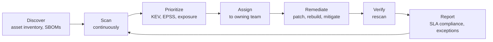

# Hardening and Compliance

## What You'll Learn

- What security benchmarks are, and how to apply them without breaking systems
- How to audit Linux hosts, Kubernetes clusters, containers, and cloud accounts
- How to build hardening into images and infrastructure code instead of fixing servers by hand
- How to run a vulnerability management program with risk-based SLAs
- How compliance frameworks relate to engineering work, and how to automate evidence

## Security Benchmarks

**CIS Benchmarks** are consensus-based configuration guidelines for operating systems, cloud providers, Kubernetes, container runtimes, databases, and more. Each recommendation explains the rationale, the audit check, and the remediation.

| Benchmark family | Covers |
|---|---|
| CIS Distribution Independent Linux, Ubuntu, RHEL | SSH, file permissions, kernel parameters, logging, services |
| CIS Docker | Daemon configuration, container runtime options |
| CIS Kubernetes (and EKS, GKE, AKS variants) | API server, kubelet, etcd, RBAC, Pod Security |
| CIS AWS, Azure, GCP Foundations | IAM, logging, monitoring, networking |

Benchmarks usually define **Level 1** (practical, low impact) and **Level 2** (defense in depth, may affect functionality). Start with Level 1, and treat every recommendation as a decision: apply it, or document why not.

Government and regulated environments may use **DISA STIGs** instead, which are stricter and more prescriptive.

## Audit Linux Hosts

### Lynis

```bash
sudo apt install -y lynis           # or install the latest from the CISOfy repository
sudo lynis audit system
```

```text
  -[ Lynis 3.x Results ]-

  Warnings (2):
  ----------------------------
  ! Found one or more vulnerable packages. [PKGS-7392]
  ! Couldn't find 2 responsive nameservers [NETW-2705]

  Suggestions (38):
  ----------------------------
  * Consider hardening SSH configuration [SSH-7408]
      - Details  : AllowTcpForwarding (set YES to NO)
  * Enable process accounting [ACCT-9622]

  Hardening index : 68 [#############       ]
```

Lynis gives a quick, prioritized list without needing a formal benchmark profile.

### OpenSCAP

For formal benchmark compliance and reports, **OpenSCAP** with the **SCAP Security Guide** evaluates hosts against CIS or STIG profiles and can generate remediation scripts or Ansible playbooks:

```bash
# RHEL family example
sudo dnf install -y openscap-scanner scap-security-guide
oscap info /usr/share/xml/scap/ssg/content/ssg-rhel9-ds.xml | grep -i profile

sudo oscap xccdf eval \
  --profile xccdf_org.ssgproject.content_profile_cis_server_l1 \
  --results results.xml --report report.html \
  /usr/share/xml/scap/ssg/content/ssg-rhel9-ds.xml
```

Ubuntu provides the Ubuntu Security Guide (`usg`) for CIS and DISA STIG profiles through Ubuntu Pro.

## Audit Kubernetes and Containers

```bash
# kube-bench: CIS Kubernetes checks, run as a Job on the cluster
kubectl apply -f https://raw.githubusercontent.com/aquasecurity/kube-bench/main/job.yaml
kubectl logs job/kube-bench

# Managed clusters: use the provider-specific variant (for example job-eks.yaml);
# control plane checks are the provider's responsibility

# Trivy: scan a running cluster's workloads and configuration
trivy k8s --report summary cluster

# Docker hosts: Docker Bench for Security checks the CIS Docker benchmark
docker run --rm --net host --pid host --userns host --cap-add audit_control \
  -v /etc:/etc:ro -v /var/lib:/var/lib:ro -v /var/run/docker.sock:/var/run/docker.sock:ro \
  docker/docker-bench-security
```

Enforce the workload-side controls continuously with [Pod Security Standards](../kubernetes/security/04-pod-security-standards.md) and admission policies rather than periodic audits alone.

## Audit Cloud Accounts

[Prowler](https://github.com/prowler-cloud/prowler) runs hundreds of checks against AWS, Azure, GCP, and Kubernetes, mapped to CIS, PCI DSS, ISO 27001, SOC 2, and other frameworks:

```bash
pipx install prowler
prowler aws --list-compliance                      # frameworks available
prowler aws --severity critical high                # a focused first pass
prowler aws --output-formats html,json-ocsf
```

Pair periodic scans with continuous services — AWS Security Hub standards and AWS Config conformance packs — described in [AWS Security and Secrets](../cloud/aws/10-security-and-secrets.md).

## Build Hardening In

Fixing servers one at a time doesn't scale and drifts. Put hardening where it's reproducible:

| Layer | How |
|---|---|
| **Machine images** | Build golden AMIs or VM images with Packer or EC2 Image Builder, applying CIS Level 1 hardening and agents, scanned before publishing |
| **Configuration management** | Ansible roles for SSH, sysctl, auditd, and services — see [Ansible Security](../ansible/production-engineering/04-security.md) |
| **Container images** | Minimal base images, non-root users, no shells in production images where practical |
| **Infrastructure as code** | Secure module defaults (encryption on, public access off), checked by IaC scanners |
| **Kubernetes** | Pod Security `restricted` by default, network policies, admission policies |
| **Cloud accounts** | Organization guardrails (SCPs), baseline stacks applied to every new account |

**Immutable infrastructure** helps: rebuild and redeploy from patched images instead of patching in place, so every running system matches a known, scanned definition.

## Vulnerability Management

Scanners generate findings. A vulnerability management **program** turns them into timely, prioritized fixes.

### Risk-based remediation SLAs

| Priority | Criteria | Remediation target |
|---|---|---|
| **P0** | In CISA's Known Exploited Vulnerabilities (KEV) catalog, or actively exploited, on an internet-facing or sensitive system | Mitigate within 48 hours |
| **P1** | Critical severity with high exploitation likelihood (high EPSS), or KEV on internal systems | 7 days |
| **P2** | High severity, or critical with low likelihood and limited exposure | 30 days |
| **P3** | Medium and low | 90 days, or next scheduled rebuild |

Adjust the targets to your risk appetite and contractual commitments. The principle is what matters: **exploitation evidence and exposure drive priority, not CVSS score alone**.

### The process



- **Know what you have.** You can't patch assets you don't know exist — inventory from cloud APIs, Kubernetes, and SBOMs.
- **Route findings to owners** automatically, using service ownership tags.
- **Fix at the source**: update the base image or dependency, rebuild, and redeploy everywhere it's used.
- **Track exceptions** with an owner, compensating controls, and an expiry date.
- **Measure**: time to remediate by priority, SLA compliance, and open critical findings on internet-facing systems.

## Compliance Frameworks

Compliance frameworks describe **what** controls an organization must have; engineering decides **how** to implement them.

| Framework | Scope | Commonly required by |
|---|---|---|
| **SOC 2** | Security, availability, confidentiality, processing integrity, privacy controls, audited over time | B2B SaaS customers |
| **ISO/IEC 27001** | An information security management system with risk-based controls | International customers, enterprises |
| **PCI DSS** | Protecting payment card data | Anyone storing, processing, or transmitting card data |
| **HIPAA** | Protecting health information | US healthcare |
| **GDPR** | Personal data of people in the EU | Organizations handling EU personal data |

Many controls overlap across frameworks: access reviews, MFA, encryption, logging, change management, vulnerability management, backups, incident response, and vendor management. Implement them once, well, and map the evidence to each framework.

## Compliance as Code

Manual evidence collection — screenshots and spreadsheets before each audit — is slow, error-prone, and only proves a control worked on one day. Automate instead:

| Control | Continuous evidence |
|---|---|
| Encryption at rest enabled | AWS Config rules, IaC scan results on every merge |
| MFA for all users | Identity provider API export, alert on exceptions |
| Code review before production | Branch protection rules and merged pull request history |
| Change management | CI/CD deployment logs linked to approved pull requests and tickets |
| Vulnerability remediation | Scanner data with remediation times per SLA |
| Access reviews | Scheduled export of group memberships, reviewed and signed off in a ticket |
| Logging and monitoring | CloudTrail organization trail status, alert rules as code |
| Backups and restore tests | Backup job status and restore test records |

Policy-as-code checks in CI (Checkov, Conftest), admission policies in clusters, and continuous cloud posture tools together produce evidence **as a side effect of normal work**. Compliance automation platforms can collect it from these sources for auditors.

## Common Mistakes

- Applying every Level 2 benchmark recommendation blindly and breaking applications.
- Hardening servers by hand, then losing it all when instances are replaced.
- Prioritizing vulnerabilities purely by CVSS score, while an exploited medium-severity issue on an internet-facing system waits.
- No asset inventory, so the most vulnerable systems are the ones nobody scans.
- Treating compliance as an annual audit project instead of continuous controls.
- Exceptions without owners or expiry dates that quietly become permanent.

## Interview Questions

- What are CIS Benchmarks, and how would you roll them out across a fleet?
- How would you audit the security configuration of a Kubernetes cluster?
- Design a vulnerability remediation SLA. What factors besides CVSS would you use?
- Why build hardening into images and infrastructure code instead of applying it to running servers?
- How can engineering teams make SOC 2 or ISO 27001 evidence collection continuous?

## Next

You've finished the Security track. Revisit [DevSecOps and Threat Modeling](01-devsecops-and-threat-modeling.md) when designing your next feature, or continue to [SRE Practices](../sre/index.md).
