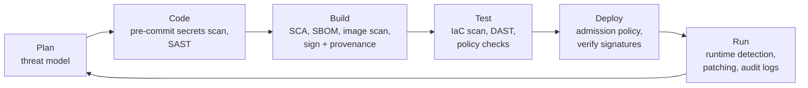

# Security

Security isn't a separate phase at the end of delivery — it's a set of habits built into how code is written, how artifacts are built, how systems are configured, and how people and workloads authenticate. This section covers the security practices DevOps and platform engineers own day to day, with tools you can put into a pipeline this week.

## What You'll Learn

- How to find the risks that matter with lightweight threat modeling
- How to manage secrets centrally, with short-lived dynamic credentials
- How to secure the software supply chain with SBOMs, signing, and provenance
- How to scan containers and infrastructure as code, and enforce policy
- How to replace network trust with strong identity for people and workloads
- How to harden systems against benchmarks and keep compliance evidence flowing

## Security Across the Delivery Lifecycle

## Read in This Order

1. [DevSecOps and Threat Modeling](01-devsecops-and-threat-modeling.md) — shifting security left and right, STRIDE threat modeling, and securing CI/CD pipelines themselves
2. [Secrets Management With Vault](02-secrets-management-with-vault.md) — Vault concepts, KV and dynamic database credentials, Kubernetes and CI authentication, and OpenBao
3. [Software Supply Chain Security](03-software-supply-chain-security.md) — SBOMs, keyless signing with Sigstore, build provenance and SLSA, and dependency hygiene
4. [Container and IaC Scanning](04-container-and-iac-scanning.md) — Trivy, Checkov, Hadolint, Conftest policies, triage, and CI integration
5. [Identity and Zero Trust](05-identity-and-zero-trust.md) — zero trust principles, SSO and phishing-resistant MFA, workload identity, mTLS, and just-in-time access
6. [Hardening and Compliance](06-hardening-and-compliance.md) — CIS benchmarks, host and cluster audits, vulnerability management, and compliance as code

## Security Topics Covered Elsewhere

| Topic | Where |
|---|---|
| Linux permissions, SSH, and sudo | [Users, sudo, and SSH Hardening](../foundations/linux/05-users-sudo-and-ssh-hardening.md) |
| TLS and certificates | [HTTP and TLS](../foundations/networking/03-http-and-tls.md) |
| Leaked secrets in Git | [Repository Hygiene](../foundations/git/05-collaboration-and-repository-hygiene.md#responding-to-a-leaked-secret) |
| AWS IAM, KMS, GuardDuty, and WAF | [AWS IAM](../cloud/aws/02-iam.md), [AWS Security and Secrets](../cloud/aws/10-security-and-secrets.md) |
| Kubernetes RBAC, Pod Security, and image policy | [Kubernetes Security](../kubernetes/security/index.md) |
| Ansible Vault | [Secrets and Vault in Ansible](../ansible/production-engineering/03-secrets-and-vault.md) |
| SAST, SCA, and secrets scanning tools | [Code Quality](../cicd/code-quality/code-quality-ecosystem.md) |
| Running a security incident | [Incident Response](../sre/03-incident-response.md) |

## Next

Start with [DevSecOps and Threat Modeling](01-devsecops-and-threat-modeling.md).
