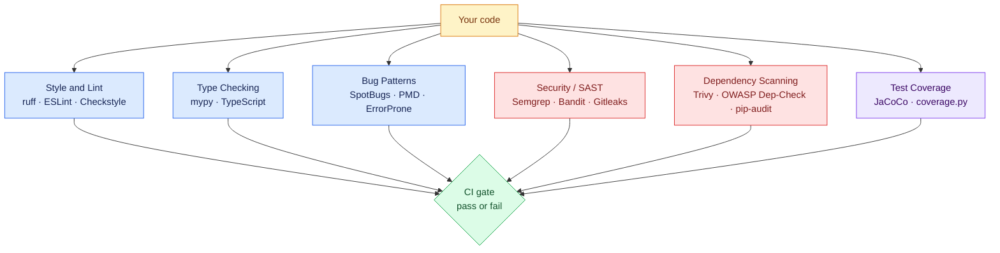
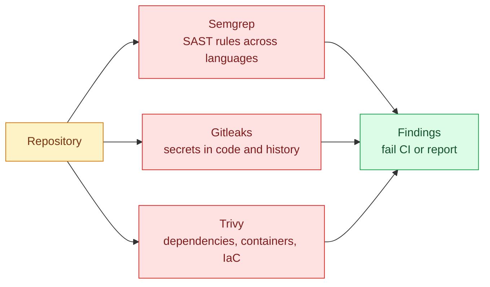
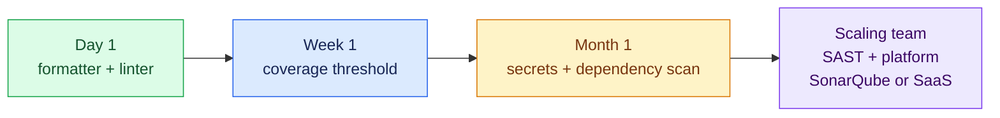

# Open-Source Code Quality Tools and Libraries

SonarQube is a *platform* that aggregates many kinds of analysis. But underneath and alongside it lives a whole ecosystem of focused open-source tools — linters, formatters, type checkers, security scanners, and coverage libraries — that most teams run directly in their pipelines. This page maps that landscape and shows how to wire the most-used tools into CI.

!!! info "How these tools relate"
    A **library/linter** (ruff, Checkstyle, ESLint) checks one language, runs in seconds, and fails fast in CI.
    A **platform** (SonarQube, [SonarCloud and friends](paid-platforms.md)) collects results over time, tracks trends, and enforces quality gates.
    Mature pipelines use both: linters for instant feedback on every push, a platform for the long-term picture.

---

## The Landscape at a Glance



Six categories, each answering a different question:

| Category | Question it answers | Speed |
|---|---|---|
| Style / lint | Is the code consistent and idiomatic? | seconds |
| Type checking | Do the types line up? | seconds–minutes |
| Bug patterns | Are there known-bad constructs? | seconds–minutes |
| Security (SAST) | Is there dangerous code or leaked secrets? | seconds–minutes |
| Dependency scanning | Are my libraries vulnerable? | seconds |
| Coverage | How much code do tests exercise? | with the test run |

---

## Python Tools

| Tool | Category | Notes |
|---|---|---|
| **ruff** | lint + format | Written in Rust; replaces flake8, isort, pyupgrade, and (mostly) black — the current default choice |
| **black** | format | The formatter ruff's formatter is modeled on; still widely used |
| **mypy** | type check | The reference type checker; `pyright` is the faster alternative |
| **bandit** | SAST | Finds `eval`, hardcoded passwords, weak crypto, SQL strings |
| **pip-audit** | dependencies | Checks installed packages against the PyPI advisory database |
| **coverage.py** | coverage | Usually via `pytest-cov` |

```bash
pip install ruff mypy bandit pip-audit pytest-cov

ruff check .            # lint
ruff format --check .   # formatting
mypy app/               # types
bandit -r app/          # security
pip-audit               # vulnerable dependencies
pytest --cov=app        # tests + coverage
```

Configuration lives in one file, `pyproject.toml`:

```toml
[tool.ruff]
line-length = 100
lint.select = ["E", "F", "I", "B", "S"]   # S = bandit-style security rules

[tool.mypy]
strict = true

[tool.coverage.report]
fail_under = 80
```

!!! tip "ruff can replace bandit for most projects"
    Enabling ruff's `S` rule family runs the bandit rule set inside ruff — one tool, one config, one CI step.

---

## Java Tools

| Tool | Category | Notes |
|---|---|---|
| **Checkstyle** | style | Enforces a coding standard (Google/Sun styles ship built in) |
| **PMD** | bug patterns | Finds empty catches, unused vars, complexity hotspots |
| **SpotBugs** | bug patterns | Successor of FindBugs; bytecode analysis, catches real bugs |
| **Error Prone** | bug patterns | Google's compiler plugin; fails the *build* on bad patterns |
| **OWASP Dependency-Check** | dependencies | CVE scan of every JAR on the classpath |
| **JaCoCo** | coverage | The standard coverage engine, integrates with Maven/Gradle |

All of them run as Maven plugins — no separate installation:

```xml
<!-- pom.xml (build/plugins) -->
<plugin>
  <groupId>com.github.spotbugs</groupId>
  <artifactId>spotbugs-maven-plugin</artifactId>
  <version>4.8.6.6</version>
</plugin>
<plugin>
  <groupId>org.apache.maven.plugins</groupId>
  <artifactId>maven-checkstyle-plugin</artifactId>
  <version>3.6.0</version>
  <configuration>
    <configLocation>google_checks.xml</configLocation>
  </configuration>
</plugin>
<plugin>
  <groupId>org.jacoco</groupId>
  <artifactId>jacoco-maven-plugin</artifactId>
  <version>0.8.12</version>
  <executions>
    <execution>
      <goals><goal>prepare-agent</goal></goals>
    </execution>
    <execution>
      <id>report</id>
      <phase>verify</phase>
      <goals><goal>report</goal></goals>
    </execution>
  </executions>
</plugin>
```

```bash
mvn checkstyle:check   # style gate
mvn spotbugs:check     # bug patterns gate
mvn verify             # tests + JaCoCo report in target/site/jacoco/
```

---

## JavaScript / TypeScript Tools

| Tool | Category | Notes |
|---|---|---|
| **ESLint** | lint | The standard; flat config (`eslint.config.js`) since v9 |
| **Prettier** | format | Opinionated formatter, pairs with ESLint |
| **Biome** | lint + format | Rust-based all-in-one challenger, very fast |
| **TypeScript** | types | `tsc --noEmit` as a CI type gate |
| **npm audit** | dependencies | Built into npm; Snyk/Trivy go deeper |

```bash
npx eslint .
npx prettier --check .
npx tsc --noEmit
npm audit --audit-level=high
```

---

## Cross-Language Security Tools

These work on any repo regardless of language — the highest-leverage additions to an existing pipeline:



- **Semgrep** — pattern-based static analysis with thousands of community rules; write custom rules in near-source syntax. The open-source engine is free; [Semgrep AppSec Platform is the paid tier](paid-platforms.md).
- **Gitleaks** — scans the working tree *and git history* for API keys, tokens, and passwords.
- **Trivy** — one binary that scans dependency lockfiles, **container images** (perfect after the [Docker build stage](../jenkins/java-github-actions.md)), Kubernetes manifests, and Terraform.

```bash
# All three, locally
semgrep scan --config auto .
gitleaks detect --source .
trivy image ghcr.io/owner/app:latest
```

---

## Putting It in CI

A quality job that slots straight into the [GitHub Actions pipelines](../jenkins/github-actions.md) from the CI/CD section — Python flavor:

```yaml
  quality:
    runs-on: ubuntu-latest
    steps:
      - uses: actions/checkout@v4
        with:
          fetch-depth: 0                    # full history for gitleaks

      - uses: actions/setup-python@v5
        with:
          python-version: "3.13"
          cache: pip

      - name: Lint, types, security
        run: |
          pip install ruff mypy bandit pip-audit
          ruff check --output-format=github .
          mypy app/
          bandit -r app/
          pip-audit

      - name: Secret scan
        uses: gitleaks/gitleaks-action@v2
        env:
          GITHUB_TOKEN: ${{ secrets.GITHUB_TOKEN }}

      - name: Semgrep
        run: |
          pip install semgrep
          semgrep scan --config auto --error .

  image-scan:
    needs: build-image
    runs-on: ubuntu-latest
    steps:
      - name: Scan the pushed image with Trivy
        uses: aquasecurity/trivy-action@0.29.0
        with:
          image-ref: ghcr.io/${{ github.repository }}:latest
          severity: HIGH,CRITICAL
          exit-code: "1"                    # fail the pipeline on findings
```

!!! tip "`--output-format=github`"
    Ruff (and many other tools) can emit GitHub annotations — findings show up as inline comments on the exact lines of the pull request diff, not just in a log.

---

## Choosing Without Overbuilding

You do not need all of these. A sane progression:



1. **Formatter + linter first** — cheapest, ends style debates (ruff / ESLint / Checkstyle).
2. **Coverage threshold** — `--cov-fail-under` / JaCoCo rule, so coverage can only ratchet up.
3. **Secrets + dependency scanning** — Gitleaks and Trivy/pip-audit; near-zero config, catches the incidents that make headlines.
4. **A platform** — when you want trends, PR decoration, and org-wide gates: self-host [SonarQube](installation.md) or pick a [paid service](paid-platforms.md).
