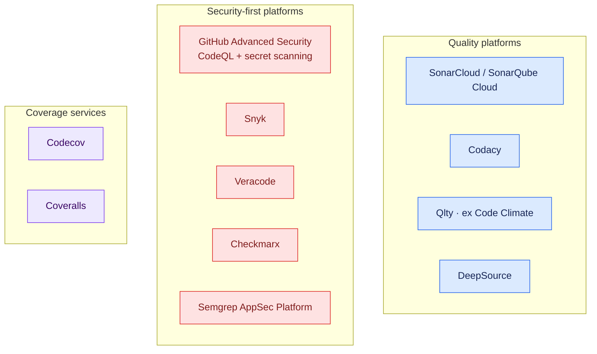
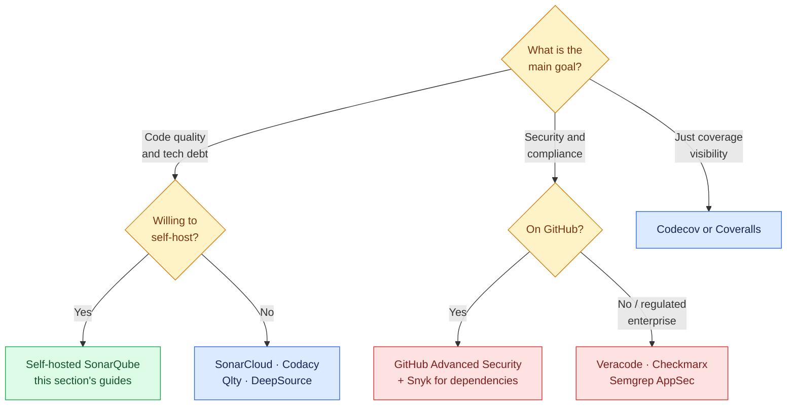

# Paid and SaaS Code Quality Platforms

The [open-source tools](code-quality-ecosystem.md) give you point-in-time checks. Paid platforms add what is hard to build yourself: hosted infrastructure, trend dashboards, pull-request decoration, org-wide policy, and compliance reporting. This page maps the market so you can pick deliberately.

!!! info "What you are actually paying for"
    Most paid platforms wrap analysis engines (sometimes the same open-source ones) with:

    - **Zero hosting** — no server to patch, scale, or back up
    - **PR decoration** — findings as review comments with pass/fail checks
    - **History and trends** — is quality improving or decaying?
    - **Policy** — one quality/security gate enforced across every repo
    - **Compliance** — SOC 2 / ISO evidence, audit trails, SBOM exports

---

## Market Map



Three clusters, three buying motions:

- **Quality platforms** — the SonarQube category: maintainability, duplication, coverage, quality gates.
- **Security-first platforms** — SAST, dependency (SCA), container, and secrets scanning; bought by security teams.
- **Coverage services** — do one thing (coverage trends and PR comments) very well and cheaply.

---

## Quick Comparison

| Platform | Category | Free tier | Pricing model | Standout feature |
|---|---|---|---|---|
| **SonarCloud** | quality | public repos | per lines of code | Same engine/rules as self-hosted SonarQube |
| **Codacy** | quality | public repos + small teams | per user/month | Wraps 40+ OSS linters with one dashboard |
| **Qlty** (ex Code Climate) | quality | generous OSS/free tier | per contributor | Maintainability grades, unified CLI |
| **DeepSource** | quality | public repos | per user/month | Autofix — opens PRs that fix its own findings |
| **GitHub Advanced Security** | security | public repos (CodeQL + secrets) | per committer (GHAS) | CodeQL semantic analysis native to GitHub |
| **Snyk** | security | limited free scans | per developer | Developer-first SCA + container + IaC, fix PRs |
| **Semgrep AppSec** | security | OSS engine free | per contributor | Custom rules in near-source syntax |
| **Veracode** | security (enterprise) | — | contract | Compliance-grade SAST/DAST, policy reporting |
| **Checkmarx** | security (enterprise) | — | contract | Deep enterprise SAST (Checkmarx One) |
| **Codecov** | coverage | public repos | per user/month | The de-facto coverage PR bot (owned by Sentry) |
| **Coveralls** | coverage | public repos | per repo/user | Simple, long-standing Codecov alternative |

!!! warning "Pricing changes often"
    SaaS pricing and free-tier limits change frequently — treat the table as orientation and check the vendor's pricing page before deciding. The *models* (per LOC, per user, per committer, contract) change far less often than the numbers.

---

## The Ones You Will Meet Most Often

### SonarCloud (SonarQube Cloud)

The hosted version of SonarQube — same rules, same quality gates, no server. If you followed this section's [installation guide](installation.md) and would rather not run the server, this is the drop-in swap. Free for public repos; priced by lines of code for private ones.

```yaml
# GitHub Actions
- name: SonarCloud scan
  uses: SonarSource/sonarqube-scan-action@v4
  env:
    SONAR_TOKEN: ${{ secrets.SONAR_TOKEN }}
```

With a `sonar-project.properties`:

```properties
sonar.organization=my-org
sonar.projectKey=my-org_my-repo
sonar.sources=app
sonar.python.coverage.reportPaths=coverage.xml
```

The PR gets a **Quality Gate** check: pass/fail on new-code coverage, duplication, and issues — the same "clean as you code" model as self-hosted SonarQube.

### GitHub Advanced Security (CodeQL)

CodeQL treats code as a queryable database and finds taint-flow bugs (user input reaching a SQL query, for example) that pattern-based linters miss. Free on public repos; on private repos it is a paid per-committer add-on (GitHub Code Security / Secret Protection).

```yaml
# .github/workflows/codeql.yml
name: CodeQL
on:
  push: { branches: [main] }
  pull_request:
  schedule: [{ cron: "0 6 * * 1" }]   # weekly full scan

jobs:
  analyze:
    runs-on: ubuntu-latest
    permissions:
      security-events: write
    strategy:
      matrix:
        language: [java, python]
    steps:
      - uses: actions/checkout@v4
      - uses: github/codeql-action/init@v3
        with:
          languages: ${{ matrix.language }}
      - uses: github/codeql-action/autobuild@v3
      - uses: github/codeql-action/analyze@v3
```

Findings land in the repo's **Security → Code scanning** tab and as PR annotations. Secret scanning (with push protection that blocks the `git push` itself) is part of the same suite.

### Snyk

Developer-first security scanning: dependencies (SCA), containers, IaC, and code (SAST). Its signature move is the **automatic fix PR** — when a vulnerable transitive dependency has a patched version, Snyk opens the upgrade PR for you.

```bash
npm install -g snyk
snyk auth
snyk test                                   # dependencies
snyk container test ghcr.io/owner/app:latest
snyk iac test k8s/
```

```yaml
# GitHub Actions
- name: Snyk dependency scan
  uses: snyk/actions/python@master
  env:
    SNYK_TOKEN: ${{ secrets.SNYK_TOKEN }}
  with:
    args: --severity-threshold=high
```

### Codecov

Not a scanner — a coverage service. Your tests produce a coverage report; Codecov stores it, trends it, and comments on every PR with exactly which changed lines are untested.

```yaml
- name: Run tests with coverage
  run: pytest --cov=app --cov-report=xml

- name: Upload to Codecov
  uses: codecov/codecov-action@v5
  with:
    token: ${{ secrets.CODECOV_TOKEN }}
    files: coverage.xml
```

---

## Decision Guide



Rules of thumb:

- **Public/open-source project** — you can get nearly everything free: SonarCloud + CodeQL + Codecov all cost nothing on public repos.
- **Small private team on GitHub** — start with the [open-source tools in CI](code-quality-ecosystem.md) (free forever), add Codecov, and consider SonarCloud when you want trends and gates.
- **Security-driven purchase** — GHAS if you live on GitHub; Snyk for the best dependency story; Veracode/Checkmarx when an auditor is asking the questions.
- **Already running SonarQube** — stay put; the self-hosted server plus free linters covers most of what the SaaS quality tier sells.

!!! tip "Paid platforms complement, not replace, the free layer"
    Even teams paying for SonarCloud or Snyk keep ruff/ESLint/Checkstyle in the pipeline — the linters fail in seconds on the developer's machine, while the platform catches what needs history and depth. Fast feedback and deep analysis are different jobs.
