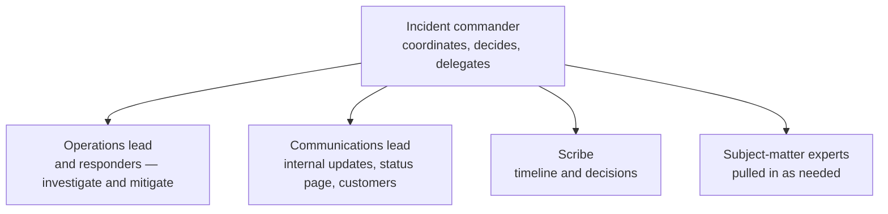
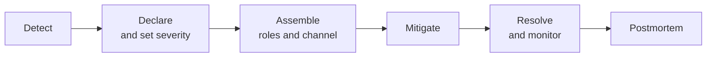

# Incident Response

## What You'll Learn

- How to declare an incident and set its severity
- The roles that keep a response organized, and why the incident commander doesn't debug
- Why mitigation comes before root cause, and the common mitigation moves
- How to communicate during an incident, internally and to customers
- What good runbooks and incident tooling look like

## What Is an Incident?

An incident is an unplanned event that disrupts or degrades a service — or threatens to — and needs a coordinated response. The goal of incident response is to **restore service quickly and safely**, while keeping everyone who needs to know informed.

**Declare early.** Declaring an incident that turns out to be minor costs a few minutes. Not declaring one that turns out to be major costs coordination, customer trust, and time. Anyone should be able to declare, without permission.

## Severity Levels

Define severities by **impact**, not by cause, and keep the list short:

| Severity | Impact | Examples | Response |
|---|---|---|---|
| **SEV1** | Critical: a core function is unavailable for many users, data loss, or a security breach | Checkout down for all users; customer data exposed | Page immediately, incident commander assigned, executive and customer communication, status page |
| **SEV2** | Major: significant degradation or a core function down for a subset of users | Checkout failing for one region; search latency 10× normal | Page, incident commander assigned, status page if customer-visible |
| **SEV3** | Minor: limited impact, workaround exists | A non-critical feature broken; one internal tool down | Working hours, owning team handles |
| **SEV4** | No current user impact, but needs follow-up | A redundant component failed; SLO burning slowly | Ticket |

When unsure, pick the **higher** severity. It's easier to downgrade.

## Roles

For SEV1 and SEV2 incidents, separate the jobs:



| Role | Responsibilities |
|---|---|
| **Incident commander (IC)** | Owns the incident. Sets priorities, assigns work, makes decisions, runs regular check-ins, decides when to escalate and when it's resolved. **Does not debug** — they hold the big picture. |
| **Operations lead / responders** | Investigate, propose mitigations, and carry out changes the IC approves. |
| **Communications lead** | Writes internal updates and customer-facing status updates on a schedule, so responders aren't interrupted. |
| **Scribe** | Records the timeline, hypotheses, actions, and decisions in the incident channel or document. |

In a small team, one person may hold several roles at first. As soon as a second person joins, hand off either the IC role or the hands-on work.

## The Incident Lifecycle



### 1. Detect

From an SLO page, a synthetic check, a customer report, or an engineer noticing something odd.

### 2. Declare

```text
/incident declare "Checkout returning 500s in eu-west-1" severity:SEV2
```

Incident tooling (incident.io, Rootly, FireHydrant, PagerDuty, Jira Service Management, or a simple bot) creates a dedicated channel, a video bridge, an incident document, and pages the on-call responders.

### 3. Assemble and orient

The IC's first message sets the frame:

```text
I'm IC for this incident.
Impact: checkout failing for ~30% of EU requests since 10:02 UTC. SEV2.
@maria is ops lead — investigating the 10:00 deploy first.
@dev is comms — first status page update by 10:20.
Next check-in: 10:25. Keep this channel for incident work; side chatter in #payments.
```

### 4. Mitigate before you understand

**Stop the user impact first; find the root cause afterward.** A rollback that restores service in five minutes beats an hour of debugging a fix forward, even if you don't yet know exactly why the deploy broke things.

| Mitigation | When |
|---|---|
| **Roll back** the last deploy or config change | Impact started around a change — the most common and usually safest option |
| **Disable a feature flag** | The new code path is behind a flag |
| **Fail over** to another region or replica | A zone, region, or primary is unhealthy |
| **Scale up or out** | Saturation from load |
| **Shed load or rate limit** | Overload or abuse; protect the core function |
| **Block bad traffic** | A single client or pattern is causing harm |
| **Restart** | Last resort for a stuck state — capture evidence first (thread dumps, logs, `kubectl describe`) |

Ask "what changed?" early: deploys, config and feature flag changes, infrastructure changes, certificate expirations, dependency incidents, and traffic spikes.

### 5. Communicate on a schedule

Updates every 15–30 minutes for SEV1 and SEV2, **even when there's nothing new**. Silence makes stakeholders interrupt responders.

```text title="Internal update"
10:25 UTC — SEV2 — Checkout errors (EU)
Status: Mitigating
Impact: ~30% of EU checkout requests failing since 10:02. US unaffected.
Actions: Rolling back orders-api 2.14.0 → 2.13.4 (started 10:22, ETA 10:30).
Next update: 10:45 or sooner if status changes.
```

```text title="Status page"
Investigating — We're seeing errors for some customers completing checkout in Europe.
Our team is working on a fix. We'll provide an update within 30 minutes.
```

Customer-facing updates say **what users experience and when to expect news**, without internal jargon or blame.

### 6. Resolve

Declare the incident resolved when impact has ended **and** the service is stable, usually after a monitoring period. Record the end time, confirm the SLI has recovered, and hand any remaining cleanup to tickets.

### 7. Follow up

SEV1 and SEV2 incidents get a [postmortem](04-postmortems.md), typically drafted within a few working days while memories are fresh.

## Runbooks

A runbook turns an alert into action for someone who may be half-awake and unfamiliar with the service.

```markdown title="runbooks/checkout-availability.md"
# Checkout availability SLO burn

**Alert:** CheckoutErrorBudgetBurnFast
**Owner:** payments team — escalate to #payments-oncall
**Dashboard:** https://grafana.example.com/d/checkout-slo

## What it means
Checkout requests are failing fast enough to exhaust the 30-day error budget within days.

## First 5 minutes
1. Check the dashboard: which region, which endpoint, what status codes?
2. Check recent changes: `kubectl -n checkout rollout history deploy/orders-api`
   and #deploys for the last 2 hours.
3. Check dependencies: payment provider status page, database dashboard.

## Mitigations
- **Recent deploy?** Roll back: `kubectl -n checkout rollout undo deploy/orders-api`
- **Payment provider errors?** Enable fallback provider flag `payments.fallback_provider`.
- **Database connections exhausted?** Scale RDS Proxy target, see "DB saturation" below.

## Escalation
- Payment provider outage: contact via the support portal, priority P1.
- Database: page #data-platform-oncall.
```

Good runbooks are **short**, start with **diagnosis steps and safe mitigations**, link to dashboards, and are updated after every incident that used them. Steps that are always the same are candidates for automation.

## Common Mistakes

- Waiting to declare an incident until the cause is understood.
- The most senior engineer acting as incident commander **and** debugging, so nobody coordinates.
- Debugging the root cause while users are still affected, instead of rolling back.
- Everyone joining the bridge and talking at once; no clear owner for each task.
- Long silences with no updates, followed by executives interrupting responders for status.
- Restarting everything immediately and destroying evidence.
- Resolving the incident the moment the graph recovers, then reopening it ten minutes later.

## Interview Questions

- What does an incident commander do, and why shouldn't they debug?
- Why mitigate before finding root cause? Give examples of mitigations.
- How do you decide the severity of an incident?
- Walk through the first 15 minutes of a SEV1 incident.
- What makes a runbook useful at 3 a.m.?

## Next

Continue to [Blameless Postmortems](04-postmortems.md).
