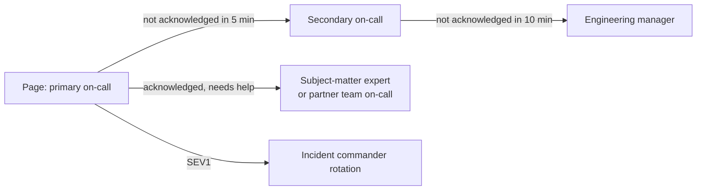

# Sustainable On-Call

## What You'll Learn

- How to design rotations and escalation policies
- What to expect of on-call responders, and what they should expect in return
- How to hand off cleanly between shifts
- How to measure on-call load and systematically reduce alert noise

## Why It Matters

On-call is where reliability practices meet real people. A rotation that pages someone five times a night will burn out good engineers, slow down incident response, and eventually cause mistakes. Sustainable on-call is a reliability requirement, not a perk.

## Who Is On Call?

**The team that builds a service should be on call for it.** Owners have the context to fix problems fast, and they feel the cost of unreliable code directly, which motivates better engineering. Central operations or SRE teams can support with tooling, escalation, and shared platforms, but separating "people who build" from "people who get paged" tends to push reliability problems onto the people least able to fix them.

## Rotation Models

| Model | How it works | Good for |
|---|---|---|
| **Weekly primary and secondary** | One primary, one secondary backup, rotating weekly | Most teams with 6+ engineers |
| **Follow-the-sun** | Teams in different time zones cover their own daytime | Distributed organizations — nobody gets paged at night |
| **Daily or split shifts** | Shorter shifts, such as business hours and after hours | High page volume, or small teams needing a break |
| **Tiered** | A front-line team handles known issues; specialists are escalations | Large platforms with many services |

A rotation needs enough people. With fewer than about **six to eight** engineers per rotation, each person is on call too often. Merge rotations across closely related services, or share with a partner team, before accepting that.

## Escalation Policies



- Escalations must be **automatic** — nobody should need to remember to escalate.
- Every service in the service catalog has an owner and a page route.
- Every team knows how to page **other** teams' on-call, without looking for names in chat.

## Responder Expectations

Write them down:

| Expectation | Typical agreement |
|---|---|
| Acknowledge a page | Within 5 minutes |
| Be at a keyboard | Within 15 minutes |
| Scope of responsibility | Mitigate and escalate — not fix every root cause during the shift |
| Availability | Reachable with a laptop and network; no activities that make response impossible |
| Swaps | Allowed and easy; recorded in the scheduling tool |

And the organization's side of the deal:

- **Compensation or time off** for on-call shifts and out-of-hours pages.
- **Recovery time** after a disruptive night — no expectation of a normal workday.
- **No project deadlines** for the primary on-call that week; they own operational work instead.
- **Training and shadowing** before joining a rotation: shadow a shift, then reverse-shadow with an experienced engineer as backup.
- **Authority to act**: permission to roll back, disable features, and escalate without asking.

## Handoffs

Write a short handoff at every shift change:

```markdown title="On-call handoff — payments — week 37"
**Outgoing:** Priya → **Incoming:** Dev

**Incidents:** INC-1042 (SEV2, checkout errors, resolved — postmortem Thursday)

**Ongoing issues:**
- Payment provider latency spikes nightly 01:00–01:30 UTC during their maintenance;
  a silence is in place until Friday. Ticket OPS-240.

**Pages this week:** 6 (4 actionable, 2 noise — OPS-241 to tune DiskPressure alert)

**Risky changes coming up:**
- Database minor version upgrade Wednesday 09:00 UTC (change CHG-88).

**Things to watch:**
- Queue age for refunds was elevated Sunday; recovered on its own.
```

## Measure On-Call Health

Track these per rotation, and review them monthly:

| Metric | Healthy target |
|---|---|
| Pages per shift | A few per week at most; Google's SRE guidance suggests no more than about two incidents per 12-hour shift |
| Out-of-hours pages | As close to zero as possible |
| Actionable ratio | Nearly every page should require action |
| Time to acknowledge | Within the agreed window |
| Repeat alerts | Same alert firing again within a week |
| Time spent on interrupts | Tracked, to justify reliability investment |

## Reduce Alert Noise

After each shift, classify every page:

| Page was… | Action |
|---|---|
| Actionable and urgent | Keep; improve the runbook if it was slow to resolve |
| Actionable, but not urgent | Downgrade to a ticket |
| Not actionable | Delete it, or turn it into a dashboard panel |
| Symptom of a known issue | Fix the issue, or silence it with an expiry and a ticket |
| Flapping | Adjust windows, use SLO burn rates, or add hysteresis |
| Duplicate of another page | Group or inhibit in Alertmanager |

The largest single improvement is usually switching from cause-based threshold alerts to [SLO burn-rate alerts](02-alerting-on-slos.md).

Hold a short **weekly on-call review**: pages, their classification, noise removed, and toil identified. Budget engineering time for these fixes like any other work — for example, a fixed share of the team's capacity for operational improvements.

## Silences

Silences prevent pages during planned work or known issues. Keep them safe:

```bash
amtool silence add alertname=PaymentProviderLatencyHigh service=payments \
  --duration=4h --author="dev" --comment="Provider maintenance window, OPS-240"
amtool silence query
```

- Always set an **expiry** and a **comment with a ticket link**.
- Silence the narrowest matcher possible — one alert and service, not a whole cluster.
- Review active silences in every handoff.

## Common Mistakes

- A rotation with three people, each on call every third week indefinitely.
- On-call engineers expected to deliver full project work on top of pages.
- No compensation, recovery time, or recognition for out-of-hours work.
- Manual escalation, so a missed page waits until someone notices.
- Accepting noisy alerts as "normal" instead of fixing or deleting them.
- Silences without expiry, hiding real problems for months.
- New engineers added to the rotation with no shadowing, runbooks, or access.

## Interview Questions

- How would you design an on-call rotation for a team of eight engineers across two time zones?
- What metrics indicate an unhealthy on-call rotation?
- How do you reduce alert fatigue on a team that gets paged ten times a week?
- Should the developers who build a service be on call for it? Why?
- What should an on-call handoff include?

## Next

Continue to [Toil and Automation](06-toil-and-automation.md).
