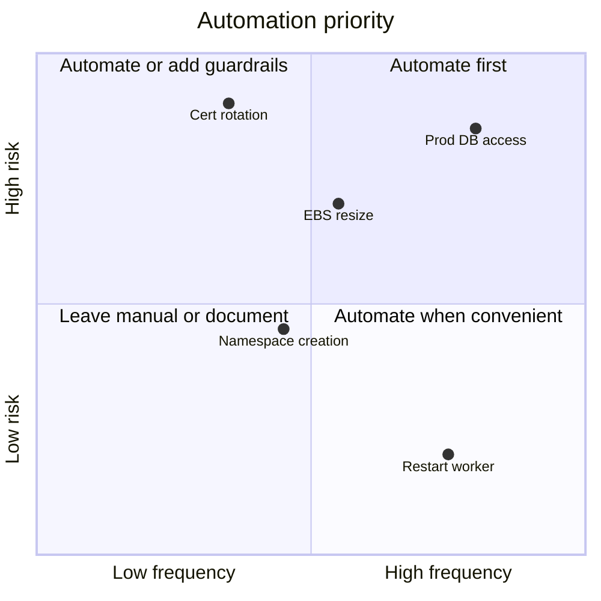

# Toil and Automation

## What You'll Learn

- What toil is, and how it differs from valuable operational work
- How to measure toil so it can be prioritized
- How to decide what to automate, and in what order
- Patterns that make automation safe, and how self-service removes whole categories of toil
- How DORA metrics show whether delivery and operations are improving

## What Toil Is

Toil is operational work that is:

| Property | Meaning |
|---|---|
| **Manual** | A person runs it by hand |
| **Repetitive** | It happens again and again |
| **Automatable** | A machine could do it |
| **Tactical** | Interrupt-driven and reactive, not planned |
| **No enduring value** | The system is no better afterward |
| **Scales with the service** | More users, hosts, or teams means more of it |

Examples: manually rotating certificates, resizing disks when an alert fires, creating accounts or namespaces on request, restarting a service that leaks memory, copying data between environments, approving routine access requests.

Not everything operational is toil. Incident response, postmortems, capacity planning, and designing automation are engineering work. Overhead such as meetings isn't toil either — it's just overhead.

## Why It Matters

Toil grows with the system. If a team spends most of its time on toil, it can't build the improvements that would reduce it — and as the service grows, the team drowns. Google's SRE practice caps toil at **50% of each engineer's time**, and aims well below that, so there's always capacity for engineering work.

Toil also hurts people: repetitive interrupt-driven work is demoralizing, error-prone, and a common reason engineers leave.

## Measure It

You can't prioritize what you don't count. Pick a lightweight method:

- **Ticket labels.** Tag operational tickets `toil` with a category, and record time spent.
- **On-call logs.** Record every interrupt during the shift: what, how long, and whether it repeats.
- **Periodic surveys.** Ask engineers each quarter to estimate toil by category.

```text title="Toil inventory (example)"
| Task                                  | Frequency  | Minutes each | Hours / month | Risk if done wrong |
|---------------------------------------|------------|--------------|---------------|--------------------|
| Create namespace + RBAC for new team  | 6 / month  | 45           | 4.5           | Medium             |
| Resize EBS volumes after disk alerts  | 10 / month | 20           | 3.3           | High               |
| Restart report-worker (memory leak)   | 20 / month | 10           | 3.3           | Low                |
| Rotate internal TLS certificates      | 4 / month  | 60           | 4.0           | High               |
| Grant temporary prod DB access        | 30 / month | 15           | 7.5           | High               |
```

## Decide What to Automate

Prioritize by **time saved**, **risk reduced**, and **growth**, against the **cost** of building and maintaining the automation.



Also ask whether the task should **exist at all**:

| Instead of automating… | Eliminate the cause |
|---|---|
| Restarting a leaking worker | Fix the memory leak |
| Resizing disks on alert | Enable volume autoscaling, or fix unbounded log growth |
| Rotating certificates manually | Use ACM or cert-manager, which renew automatically |
| Granting database access by hand | Just-in-time access through an access broker with approval and expiry |

## Levels of Automation

Automation doesn't have to be all or nothing:

| Level | Example |
|---|---|
| 1. Documented procedure | A runbook with exact commands |
| 2. Script a human runs | `opsctl resize-volume --volume vol-0abc --size 200` |
| 3. Script triggered by a human approval | A ChatOps command or a pipeline with a manual approval step |
| 4. Automatic with notification | Automation runs on an alert and posts what it did |
| 5. Fully autonomous, self-healing | The platform handles it; nobody needs to know |

Move up a level only when the previous one is reliable and well understood.

## Make Automation Safe

Automation acts fast and at scale — including when it's wrong.

- **Dry-run by default**, and show exactly what will change.
- **Idempotency**: running twice produces the same result as running once.
- **Limits and circuit breakers**: never terminate more than N instances, resize more than N volumes, or change more than N% of a fleet in one run. Stop if error rates rise.
- **Rate limiting and staged rollout**: one host, then one AZ, then everything.
- **Audit logging**: record who or what triggered each action, and what changed.
- **Least privilege**: automation roles can do only what the task needs.
- **A kill switch**: a simple way to disable the automation during an incident.
- **Tests**, including against a sandbox — see [Testing Python Automation](../foundations/python/06-testing-linting-and-packaging.md).

```python title="A guardrail example"
MAX_TERMINATIONS_PER_RUN = 5

candidates = find_unhealthy_instances()
if len(candidates) > MAX_TERMINATIONS_PER_RUN:
    alert_humans(
        f"{len(candidates)} instances look unhealthy — more than the safety limit "
        f"of {MAX_TERMINATIONS_PER_RUN}. Not terminating anything automatically."
    )
    raise SystemExit(2)
```

A large number of "unhealthy" instances is more likely to mean a broken health check or a bad deploy than a coincidence. The safe response is to stop and ask a human.

## Self-Service

Many requests to operations teams are toil for **both** sides: the requester waits, and an engineer does something routine. Replace request queues with self-service that has guardrails built in:

| Request | Self-service replacement |
|---|---|
| "Create a new service repo and pipeline" | A service template (Backstage software template, cookiecutter, or `gh repo create --template`) that generates the repository, CI, dashboards, and alerts |
| "Give my team a namespace" | A pull request to a GitOps repository that creates the namespace, quotas, RBAC, and network policies from a module |
| "I need a database" | A Terraform module or Crossplane claim with approved sizes and backups on by default |
| "Give me production access" | Just-in-time access with approval, audit logging, and automatic expiry |

This is the core idea behind internal developer platforms: the platform team builds **paved roads**, and product teams move quickly without filing tickets.

## Measuring Delivery and Operations: DORA Metrics

The DORA research program identified metrics that together describe software delivery performance:

| Metric | Measures |
|---|---|
| **Deployment frequency** | How often changes reach production |
| **Change lead time** | Time from commit to running in production |
| **Change fail rate** | Share of deployments that cause a failure needing remediation |
| **Failed deployment recovery time** | How quickly service is restored after a failed deployment |

Throughput and stability improve **together** in high-performing teams — frequent, small changes are both faster and safer. Reducing toil, automating deployments, and practicing fast rollback move all four metrics in the right direction. Track trends for your own teams rather than comparing against other organizations.

## Common Mistakes

- Treating toil as "just part of the job" and never measuring it.
- Automating a broken process instead of eliminating the cause.
- Automation with no dry-run, no limits, and no kill switch, which turns a small mistake into a fleet-wide outage.
- Big automation projects that take quarters before saving any time, instead of incremental scripts.
- Automation nobody owns, that breaks silently when an API changes.
- Using DORA metrics to rank teams or individuals, which encourages gaming them.

## Interview Questions

- What is toil? Give examples of work that is and isn't toil.
- How would you measure toil on a team?
- How do you decide which operational tasks to automate first?
- What safeguards should automation that terminates instances have?
- What are the DORA metrics, and why do throughput and stability improve together?

## Next

Continue to [Capacity Planning and Load Testing](07-capacity-planning-and-load-testing.md).
