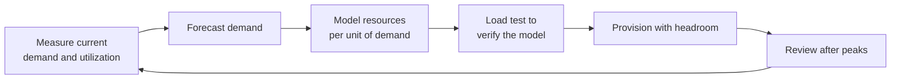

# Capacity Planning and Load Testing

## What You'll Learn

- How to forecast demand and translate it into resource needs
- How much headroom to keep, and why N+1 and zone failures matter
- The types of load tests, and what each one tells you
- How to write, run, and automate load tests with k6

## Why Plan Capacity in the Cloud?

Autoscaling doesn't make capacity planning unnecessary:

- Autoscaling reacts in minutes; traffic spikes arrive in seconds.
- Account quotas, database connections, IP addresses, and third-party rate limits don't autoscale.
- Databases and stateful systems often can't scale out quickly, or at all.
- Committed discounts need a forecast of steady usage.
- Some events are predictable — launches, sales, marketing campaigns, seasonal peaks — and should be planned for, not reacted to.

## The Capacity Planning Loop



### 1. Measure demand in business terms

Track the drivers of load, not just CPU: requests per second by endpoint, orders per minute, active users, messages processed, data ingested. Record the **peak** (for example the busiest 5 minutes of the week), not only averages.

### 2. Forecast

Start simply:

- **Organic growth**: fit a trend to the last 6–12 months of weekly peaks.
- **Seasonality**: compare to the same period last year (holidays, month-end, tax deadlines).
- **Known events**: product launches, campaigns, migrations bringing in new users, provided by product and marketing.

```promql
# Weekly peak requests per second over the last 90 days, for trending
max_over_time(sum(rate(http_requests_total{job="checkout"}[5m]))[7d:5m])
```

Prometheus's `predict_linear` is useful for near-term resource exhaustion:

```promql
# Will this filesystem fill within 7 days at the current trend?
predict_linear(node_filesystem_avail_bytes{mountpoint="/var/lib/postgresql"}[14d], 7 * 24 * 3600) < 0
```

### 3. Model resources per unit of demand

From production metrics and load tests, find how much of each resource one unit of demand needs:

| Resource | Measurement | Example |
|---|---|---|
| App CPU | Cores per 100 requests/second | 0.6 cores per 100 rps |
| Pods | Max rps per pod at the latency SLO | 180 rps per pod |
| Database | Connections and IOPS per 100 rps | 12 connections, 300 IOPS |
| Queue workers | Messages per second per worker | 45 msg/s per worker |

### 4. Provision with headroom

```text
required pods = (forecast peak rps ÷ rps per pod) × (1 + headroom) , then round up for zone failure
```

Headroom covers forecasting error, sudden spikes, and the time it takes autoscaling to react. A common starting point is **30–50%** above the forecast peak for services that scale quickly, and more for those that don't.

**Plan for failure, not just load.** With three Availability Zones, losing one zone removes a third of capacity. To stay within SLO during a zone outage at peak, the remaining two zones must carry the full load:

| Forecast peak | Pods needed at peak | Across 3 AZs, survive one AZ loss |
|---|---|---|
| 2,700 rps at 180 rps/pod | 15 | 8 per AZ (24 total) — two AZs provide 16 |

## Find the Bottleneck

Every system has one resource that limits it first. Scaling anything else doesn't help. Common bottlenecks, roughly in the order teams discover them:

1. Database connections or a single slow query
2. A dependency's rate limit or capacity
3. Thread pools, connection pools, or worker counts in the application
4. CPU limits and throttling in containers
5. Load balancer or NAT port limits
6. Account and service quotas

Load testing finds the bottleneck **before** production traffic does.

## Types of Load Tests

| Test | Load profile | Answers |
|---|---|---|
| **Smoke** | A few users for a minute | Does the script and environment work at all? |
| **Load** | Expected peak, sustained | Do we meet the SLO at normal peak? |
| **Stress** | Increase beyond peak until it breaks | Where's the breaking point, and how does it fail? |
| **Spike** | Sudden jump to a high level | Does autoscaling react fast enough? Do we fail gracefully? |
| **Soak** | Normal load for hours | Memory leaks, connection leaks, disk growth, degradation over time |
| **Breakpoint** | Ramp steadily until SLOs are violated | Maximum supported throughput for the capacity model |

## Load Testing With k6

[Grafana k6](https://grafana.com/docs/k6/latest/) scripts load tests in JavaScript and runs them efficiently from a single binary.

```bash
brew install k6          # or see the k6 docs for Linux packages and Docker
k6 version
```

### A load test with SLO thresholds

```javascript title="load/checkout-load.js"
import http from "k6/http";
import { check, sleep } from "k6";

export const options = {
  scenarios: {
    checkout_peak: {
      executor: "ramping-arrival-rate",   // model requests per second, not virtual users
      startRate: 50,
      timeUnit: "1s",
      preAllocatedVUs: 200,
      maxVUs: 1000,
      stages: [
        { target: 300, duration: "5m" },   // ramp to expected peak
        { target: 300, duration: "15m" },  // hold peak
        { target: 0, duration: "2m" },     // ramp down
      ],
    },
  },
  thresholds: {
    // Fail the test if SLOs aren't met
    http_req_failed: ["rate<0.005"],                    // under 0.5% errors
    "http_req_duration{endpoint:checkout}": ["p(95)<500", "p(99)<1200"],
    checks: ["rate>0.99"],
  },
};

const BASE_URL = __ENV.BASE_URL || "https://staging.example.com";

export default function () {
  const cart = http.get(`${BASE_URL}/api/cart/demo`, { tags: { endpoint: "cart" } });
  check(cart, { "cart 200": (r) => r.status === 200 });

  const res = http.post(
    `${BASE_URL}/api/checkout`,
    JSON.stringify({ cartId: "demo", paymentMethod: "test-card" }),
    { headers: { "Content-Type": "application/json" }, tags: { endpoint: "checkout" } },
  );
  check(res, { "checkout 201": (r) => r.status === 201 });

  sleep(1);
}
```

```bash
k6 run -e BASE_URL=https://staging.example.com load/checkout-load.js
```

k6 exits non-zero when a threshold fails, so the same script works as a **gate in CI**.

### A stress test to find the breaking point

```javascript title="load/checkout-breakpoint.js"
// Reuse the same user journey as the load test, with a different load profile
import checkoutJourney from "./checkout-load.js";

export default checkoutJourney;

export const options = {
  scenarios: {
    breakpoint: {
      executor: "ramping-arrival-rate",
      startRate: 100,
      timeUnit: "1s",
      preAllocatedVUs: 500,
      maxVUs: 5000,
      stages: [{ target: 3000, duration: "30m" }],   // keep ramping
    },
  },
  thresholds: {
    http_req_failed: [{ threshold: "rate<0.05", abortOnFail: true, delayAbortEval: "1m" }],
    http_req_duration: [{ threshold: "p(95)<2000", abortOnFail: true, delayAbortEval: "1m" }],
  },
};
```

The request rate when the test aborts is your breaking point for the tested capacity. Watch the dashboards during the test to see **which resource saturated first**.

## Running Load Tests Responsibly

- **Test a production-like environment** — same instance types, database size, data volume, and configuration. Results from a tiny staging environment don't transfer.
- **Tell people.** Announce tests; dependent teams and third-party providers may see the traffic as an attack.
- **Don't load test third parties** unless they allow it. Use sandbox endpoints or mocks for payment providers and external APIs.
- **Generate load from enough machines**, and check the load generator itself isn't the bottleneck (CPU on the k6 host, network limits).
- **Use realistic traffic mixes** — ratios of reads to writes, cache hit rates, and data sizes similar to production.
- **Clean up test data**, or use dedicated test tenants.
- **Record results** next to the capacity model, so the next forecast starts from facts.

## Automate It

```yaml title=".github/workflows/load-test.yml"
name: Nightly load test
on:
  schedule:
    - cron: "0 2 * * 1-5"
  workflow_dispatch:

permissions:
  contents: read

jobs:
  k6:
    runs-on: ubuntu-latest
    steps:
      - uses: actions/checkout@v7
      - uses: grafana/setup-k6-action@v1
      - uses: grafana/run-k6-action@v1
        env:
          BASE_URL: https://staging.example.com
        with:
          path: load/checkout-load.js
```

Run a short load test after significant changes and a full one on a schedule, and track the maximum supported throughput over time. A drop means a performance regression shipped.

## Common Mistakes

- Relying on autoscaling alone, and discovering quota, database, or dependency limits during a peak.
- Planning for average load instead of peak, and ignoring the loss of an Availability Zone.
- Load testing with virtual users that sleep unrealistically, instead of modeling arrival rate.
- Testing a scaled-down staging environment and trusting the numbers for production.
- Load testing a payment provider or other third party without permission.
- Running the load generator on an undersized machine and measuring its limits instead of the system's.
- Load tests that produce a report nobody reads, instead of thresholds that fail the pipeline.

## Interview Questions

- Why do you still need capacity planning when you use autoscaling?
- How much capacity do you need to survive the loss of one of three Availability Zones at peak?
- What's the difference between load, stress, spike, and soak testing?
- How would you find the bottleneck of a service before a major product launch?
- How would you use load tests in CI to prevent performance regressions?

## Next

You've finished the SRE track. Continue to [Security](../security/index.md), or revisit [Monitoring](../monitoring-tools/index.md) to build the metrics these practices depend on.
