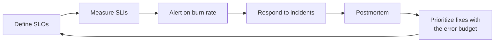

# Site Reliability Engineering

Monitoring tools tell you what's happening. SRE practices decide what to do about it: how reliable a service needs to be, when to page a human, how to run an incident, how to learn from it, and how to keep the people on call healthy. This section turns those ideas into concrete, copyable practices.

## What You'll Learn

- How to define reliability in terms users care about, with SLIs, SLOs, and error budgets
- How to alert on SLO burn rate instead of noisy thresholds
- How to run incidents with clear roles and communication
- How to write blameless postmortems that lead to real improvements
- How to design on-call that's sustainable, and reduce the toil that burns teams out
- How to plan capacity and prove it with load tests

## The Reliability Loop

## Read in This Order

1. [SLIs, SLOs, and Error Budgets](01-slis-slos-and-error-budgets.md) — choosing indicators, setting targets, computing budgets, and error budget policies
2. [Alerting on SLOs](02-alerting-on-slos.md) — multi-window, multi-burn-rate alerts with working Prometheus rules
3. [Incident Response](03-incident-response.md) — severity levels, roles, communication, mitigation first, and runbooks
4. [Blameless Postmortems](04-postmortems.md) — timelines, contributing factors, action items that get done, and a template
5. [Sustainable On-Call](05-on-call.md) — rotations, handoffs, escalation, alert hygiene, and measuring on-call health
6. [Toil and Automation](06-toil-and-automation.md) — identifying toil, measuring it, and deciding what to automate
7. [Capacity Planning and Load Testing](07-capacity-planning-and-load-testing.md) — forecasting, headroom, and load tests with k6

## SRE and DevOps

DevOps describes a culture of shared ownership between building and running software. SRE is one concrete way to practice it, with engineering-driven reliability targets, budgets, and automation. You don't need a team called "SRE" to use these practices — product teams that own their services benefit from every chapter here.

## How This Connects

| Practice | Built on |
|---|---|
| Measuring SLIs | [Prometheus](../monitoring-tools/prometheus.md), [CloudWatch](../cloud/aws/09-observability-cloudwatch.md), and [observability fundamentals](../monitoring-tools/observability-fundamentals.md) |
| Routing pages | [Alertmanager](../monitoring-tools/alertmanager.md) |
| Safe changes | [Progressive delivery](../kubernetes/cicd-and-gitops/03-progressive-delivery-canary-and-blue-green.md) and [CI/CD](../cicd/index.md) |
| Diagnosing incidents | [Linux performance](../foundations/linux/07-performance-troubleshooting.md), [network troubleshooting](../foundations/networking/05-network-troubleshooting-toolkit.md), [Kubernetes troubleshooting](../kubernetes/troubleshooting/index.md) |

## Next

Start with [SLIs, SLOs, and Error Budgets](01-slis-slos-and-error-budgets.md).
