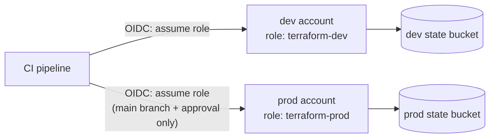

# Environments and Workspaces

## What You'll Learn

- The two main ways to manage dev, staging, and production with Terraform
- What CLI workspaces are, and where they're a good or bad fit
- How to isolate environments with separate state, credentials, and cloud accounts
- How to promote a change from dev to production without drift between environments

## The Goal

Every environment should run **the same code** with **different inputs**, with **separate state**, so that a mistake while working on dev can't touch production.

## Option 1: A Directory per Environment

```text
infrastructure/
├── modules/
│   ├── network/
│   └── web_service/
└── envs/
    ├── dev/
    │   ├── backend.tf        # key = "shop/dev/terraform.tfstate"
    │   ├── providers.tf      # dev account role
    │   ├── main.tf           # calls ../../modules/*
    │   └── terraform.tfvars  # small instances, 1 replica
    ├── staging/
    │   └── ...
    └── prod/
        ├── backend.tf        # key = "shop/prod/terraform.tfstate", separate bucket
        ├── providers.tf      # prod account role
        ├── main.tf
        └── terraform.tfvars  # production sizing
```

```hcl title="envs/prod/main.tf"
module "network" {
  source = "../../modules/network"
  cidr   = var.vpc_cidr
}

module "checkout" {
  source           = "../../modules/web_service"
  name             = "checkout"
  vpc_id           = module.network.vpc_id
  subnet_ids       = module.network.private_subnet_ids
  instance_type    = var.checkout_instance_type
  desired_capacity = var.checkout_capacity
}
```

```bash
cd envs/prod
terraform init
terraform plan
```

**Strengths:** it's obvious which environment you're in; each environment has its own backend, credentials, and can intentionally differ (production might have a WAF that dev doesn't). **Weakness:** some repeated wiring between `main.tf` files — keep the logic in modules so the repetition is only glue.

## Option 2: CLI Workspaces

A workspace is a **named instance of state** for the same configuration directory:

```bash
terraform workspace list
terraform workspace new staging
terraform workspace select staging
terraform plan -var-file=staging.tfvars
terraform workspace show
```

With an S3 backend, non-default workspaces store state under `env:/<workspace>/<key>`. Configuration can read the current name:

```hcl
locals {
  environment = terraform.workspace
  sizes = {
    default = "t3.micro"
    staging = "t3.small"
    prod    = "m7i.large"
  }
  instance_type = local.sizes[terraform.workspace]
}
```

### Where workspaces fit

| Good fit | Poor fit |
|---|---|
| Short-lived copies of the same stack: per-feature-branch or per-developer test environments | Separating production from non-production |
| Identical regional copies with the same credentials | Environments that need different providers, accounts, or resources |
| Experiments you'll destroy soon | Anything where "wrong workspace selected" is a serious incident |

The risk is simple: all workspaces share one backend configuration and usually one set of credentials. Nothing in the directory tells you which workspace is selected, so `terraform apply` in the wrong one is easy.

!!! note "HCP Terraform workspaces are different"
    In HCP Terraform (and similar platforms), a "workspace" is a separate unit with its own state, variables, credentials, and permissions — closer to Option 1's directories than to CLI workspaces.

## Isolate Environments at the Account Level

Directories and workspaces separate **state**. Real isolation comes from separate **cloud accounts** (or subscriptions/projects):



```hcl title="envs/prod/providers.tf"
provider "aws" {
  region = "us-east-1"

  assume_role {
    role_arn = "arn:aws:iam::111122223333:role/terraform-prod"
  }

  allowed_account_ids = ["111122223333"]
}
```

`allowed_account_ids` makes Terraform refuse to run if the credentials point at the wrong account — a cheap, effective guard.

- Dev credentials can't reach production at all.
- Production state lives in a bucket only production pipelines can read.
- Only the `main` branch, after approval, can assume the production role.

## Promoting Changes Between Environments

The safest promotion flow changes **one input at a time** and moves the same code forward:

1. Change a module; release it as a new version (or merge it, for in-repository modules).
2. Bump the module version in `envs/dev`, plan, apply, verify.
3. Repeat for `envs/staging`, then `envs/prod`, each through its own pull request and plan review.

```hcl
module "checkout" {
  source  = "git::https://git.example.com/platform/tf-web-service.git?ref=v2.4.0"   # prod still on v2.3.1 until promoted
}
```

With in-repository modules, every environment picks up module changes at once — that's simpler, but it means a module change is planned against all environments in the same pull request. Run plans for every environment in CI so reviewers see the full impact.

## Keeping Environments From Drifting Apart

- Keep differences in `.tfvars` inputs, not in copy-pasted resource blocks.
- Review a diff of environment directories periodically: `diff -r envs/staging envs/prod`.
- Run scheduled plans for every environment to catch drift — see [Testing and CI/CD](testing-and-ci.md#scheduled-drift-detection).
- For many environments and regions, orchestration tools such as Terragrunt or Terramate generate backends and wiring from a single definition.

## Common Mistakes

- Using CLI workspaces to separate production, with shared credentials and one wrong `workspace select` away from disaster.
- One state file for all environments.
- Dev and prod in the same cloud account, so a dev mistake can delete production resources.
- Copy-pasting resources between environment directories until they silently diverge.
- Changing module code and applying production before dev and staging have run it.

## Interview Questions

- Compare directory-per-environment layouts with CLI workspaces. When would you use each?
- Why aren't CLI workspaces enough to isolate production?
- How do you stop Terraform from ever running with production credentials against the wrong account?
- How would you promote a module change from dev to production safely?

## Next

Continue to [Testing and CI/CD](testing-and-ci.md).
