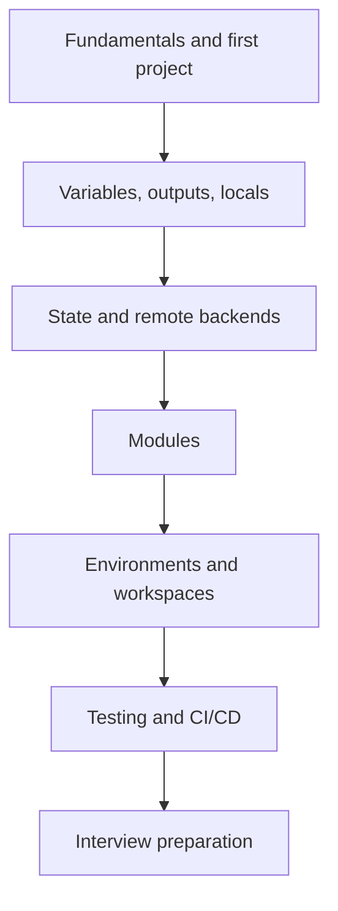

# Terraform

Terraform lets you describe infrastructure — networks, servers, databases, DNS records, Kubernetes clusters — as code, preview exactly what will change, and apply those changes the same way every time. This section takes you from a first project that runs on your laptop with no cloud account to the practices teams use to run Terraform safely in production: remote state, reusable modules, isolated environments, automated tests, and plan-and-apply pipelines.

## Start Here, Based on Where You Are

| You are... | Start at |
|---|---|
| New to Terraform entirely | [Fundamentals and Your First Project](overview.md) |
| Writing configurations, want them reusable | [Variables, Outputs, and Locals](variables-outputs-and-locals.md), then [Modules](modules.md) |
| Working in a team, or state is getting scary | [State and Remote Backends](state-and-backends.md) |
| Managing dev, staging, and production | [Environments and Workspaces](environments-and-workspaces.md) |
| Setting up pull-request plans and automated applies | [Testing and CI/CD](testing-and-ci.md) |
| Preparing for an interview | [Interview Questions](interview-questions.md) |

## The Learning Path

## Every Page

1. [Fundamentals and Your First Project](overview.md) — providers, resources, the init/plan/apply loop, the lock file, and a hands-on project with no cloud account needed
2. [Variables, Outputs, and Locals](variables-outputs-and-locals.md) — typed inputs with validation, sensitive values, `for_each` vs. `count`, data sources, and lifecycle rules
3. [State and Remote Backends](state-and-backends.md) — what state holds, S3 backends with native locking, drift, `import`, `moved`, and `removed` blocks
4. [Modules](modules.md) — module structure, inputs and outputs as a contract, versioning, and composition
5. [Environments and Workspaces](environments-and-workspaces.md) — directory-per-environment layouts, CLI workspaces, and account isolation
6. [Testing and CI/CD](testing-and-ci.md) — `fmt`, `validate`, TFLint, security scanning, `terraform test`, and a GitHub Actions plan-and-apply pipeline with OIDC
7. [Interview Questions](interview-questions.md) — core, scenario, and senior questions with answers

## How Terraform Fits With the Rest of This Site

| Layer | Tool | Where |
|---|---|---|
| Cloud resources, networks, managed services | **Terraform** | This section |
| The AWS services you provision | AWS | [AWS](../cloud/aws/index.md) |
| Operating system and host configuration | Ansible | [Ansible](../ansible/index.md) |
| Container images | Docker | [Docker](../docker/index.md) |
| Application workloads | Kubernetes | [Kubernetes](../kubernetes/index.md) |
| Pipelines that run all of the above | CI/CD | [CI/CD Pipelines](../cicd/index.md) |

## Further Reading

- [Terraform documentation](https://developer.hashicorp.com/terraform/docs)
- [Terraform Registry](https://registry.terraform.io/)
- [OpenTofu documentation](https://opentofu.org/docs/) — the open-source fork, largely compatible with the concepts on these pages
