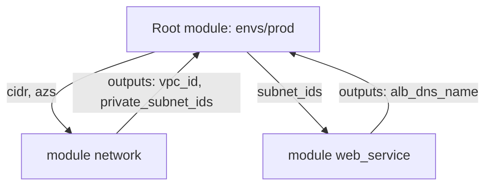

# Modules

## What You'll Learn

- What a module is, and the standard file layout
- How to design inputs and outputs as a stable contract
- Why reusable modules shouldn't configure providers, and how to pass them in
- How to source, version, and publish modules
- How to compose modules into an environment, and refactor existing code into modules without destroying resources

## Mental Model

> Every directory of `.tf` files is a module. The directory where you run `terraform` is the **root module**; modules it calls are **child modules**. A child module is a function: variables in, resources created, outputs returned. Nothing inside it is visible to the caller except its outputs.



## Module Layout

```text
modules/web_service/
├── README.md          # what it does, inputs, outputs, example
├── versions.tf        # required Terraform and provider versions
├── variables.tf       # inputs
├── main.tf            # resources
├── outputs.tf         # outputs
└── tests/
    └── defaults.tftest.hcl
```

## Writing a Module

```hcl title="modules/web_service/versions.tf"
terraform {
  required_version = ">= 1.10"

  required_providers {
    aws = {
      source  = "hashicorp/aws"
      version = ">= 6.0"          # minimum the module needs; the root pins the exact version
    }
  }
}
```

```hcl title="modules/web_service/variables.tf"
variable "name" {
  description = "Service name, used as a prefix for all resources."
  type        = string

  validation {
    condition     = can(regex("^[a-z][a-z0-9-]{2,30}$", var.name))
    error_message = "name must be lowercase letters, digits, and dashes, 3-31 characters."
  }
}

variable "vpc_id" {
  description = "VPC to deploy into."
  type        = string
}

variable "subnet_ids" {
  description = "Private subnets for instances."
  type        = list(string)
}

variable "instance_type" {
  description = "EC2 instance type."
  type        = string
  default     = "t3.small"
}

variable "desired_capacity" {
  description = "Number of instances."
  type        = number
  default     = 2
}

variable "tags" {
  description = "Extra tags merged onto every resource."
  type        = map(string)
  default     = {}
}
```

```hcl title="modules/web_service/main.tf"
locals {
  tags = merge(var.tags, { Service = var.name })
}

resource "aws_security_group" "this" {
  name_prefix = "${var.name}-"
  vpc_id      = var.vpc_id
  tags        = local.tags
}

resource "aws_launch_template" "this" {
  name_prefix   = "${var.name}-"
  image_id      = data.aws_ami.al2023.id
  instance_type = var.instance_type
  vpc_security_group_ids = [aws_security_group.this.id]
  tags          = local.tags

  lifecycle {
    create_before_destroy = true
  }
}

resource "aws_autoscaling_group" "this" {
  name_prefix         = "${var.name}-"
  vpc_zone_identifier = var.subnet_ids
  desired_capacity    = var.desired_capacity
  min_size            = 1
  max_size            = max(var.desired_capacity * 2, 2)

  launch_template {
    id      = aws_launch_template.this.id
    version = aws_launch_template.this.latest_version
  }
}

data "aws_ami" "al2023" {
  most_recent = true
  owners      = ["amazon"]
  filter {
    name   = "name"
    values = ["al2023-ami-*-x86_64"]
  }
}
```

```hcl title="modules/web_service/outputs.tf"
output "security_group_id" {
  description = "Security group attached to the instances; add ingress rules from the caller."
  value       = aws_security_group.this.id
}

output "autoscaling_group_name" {
  description = "Name of the Auto Scaling group."
  value       = aws_autoscaling_group.this.name
}
```

## Calling a Module

```hcl title="envs/prod/main.tf"
module "network" {
  source  = "terraform-aws-modules/vpc/aws"
  version = "~> 6.0"

  name            = "shop-prod"
  cidr            = "10.20.0.0/16"
  azs             = ["us-east-1a", "us-east-1b", "us-east-1c"]
  private_subnets = ["10.20.1.0/24", "10.20.2.0/24", "10.20.3.0/24"]
  public_subnets  = ["10.20.101.0/24", "10.20.102.0/24", "10.20.103.0/24"]
}

module "checkout" {
  source = "../../modules/web_service"

  name             = "checkout"
  vpc_id           = module.network.vpc_id
  subnet_ids       = module.network.private_subnets
  instance_type    = "m7i.large"
  desired_capacity = 4
  tags             = { Team = "payments" }
}

output "checkout_asg" {
  value = module.checkout.autoscaling_group_name
}
```

After adding or changing a module `source`, run `terraform init` (or `terraform get`) so Terraform downloads it.

## Module Sources

| Source | Example | Versioning |
|---|---|---|
| Local path | `source = "../../modules/web_service"` | Same commit as the caller |
| Public or private registry | `source = "acme/web-service/aws"` + `version = "~> 2.1"` | `version` constraint |
| Git | `source = "git::https://git.example.com/platform/tf-web-service.git?ref=v2.1.0"` | Tag or commit in `ref` |
| S3 / GCS archive | `source = "s3::https://s3.amazonaws.com/acme-modules/web-service-2.1.0.zip"` | File name |

Pin shared modules. A Git source without `?ref=` follows the default branch, so a module change can alter production on the next plan without anyone touching the environment.

## Providers Belong to the Root

Reusable modules declare `required_providers` but **don't** contain `provider` blocks. The root module configures providers and passes them in. That keeps regions, accounts, and credentials in one place, and lets modules be removed cleanly.

```hcl title="envs/prod/providers.tf"
provider "aws" {
  region = "us-east-1"
}

provider "aws" {
  alias  = "dr"
  region = "us-west-2"
}
```

```hcl title="envs/prod/main.tf"
module "backup_bucket" {
  source = "../../modules/replicated_bucket"

  providers = {
    aws         = aws
    aws.replica = aws.dr
  }
}
```

The child module declares which aliases it expects:

```hcl title="modules/replicated_bucket/versions.tf"
terraform {
  required_providers {
    aws = {
      source                = "hashicorp/aws"
      configuration_aliases = [aws.replica]
    }
  }
}
```

## Designing a Good Interface

- **Few required inputs, sensible defaults.** A module that needs 40 variables isn't abstracting anything.
- **Typed, validated, and described inputs** — descriptions become the generated documentation (`terraform-docs`).
- **Return IDs, not whole objects**, unless callers truly need everything.
- **Opinionated where it matters**: encryption on, public access off, tags applied — so every caller gets the secure default.
- **Don't wrap a single resource** just to rename its arguments; that adds maintenance without value.
- **Composition over nesting.** Prefer a root module that wires several flat modules together over modules that call modules that call modules.

## Versioning and Releasing

Treat a shared module like a library, with semantic versioning:

| Change | Version |
|---|---|
| Remove or rename a variable or output; change a default that changes infrastructure | Major |
| Add an optional variable or output | Minor |
| Fix without interface or infrastructure change | Patch |

Include `moved` blocks in the module when you rename resources inside it, so callers upgrading don't get replacements. Publish through Git tags, a private registry (HCP Terraform, GitLab, Artifactory), or the public Terraform Registry (`terraform-<PROVIDER>-<NAME>` repository naming).

## Refactoring Existing Code Into a Module

You have resources directly in the root module and want to move them into `modules/web_service`:

1. Create the module and replace the resource blocks with a `module "checkout"` call.
2. Add `moved` blocks mapping every old address to the new one:

    ```hcl
    moved {
      from = aws_autoscaling_group.checkout
      to   = module.checkout.aws_autoscaling_group.this
    }

    moved {
      from = aws_launch_template.checkout
      to   = module.checkout.aws_launch_template.this
    }
    ```

3. Run `terraform init` and `terraform plan`. The goal is **0 to add, 0 to change, 0 to destroy**, with each resource listed as moved.
4. Apply, then remove the `moved` blocks after all environments have applied.

## Common Mistakes

- `provider` blocks inside reusable modules, making them impossible to reuse across regions and hard to delete.
- Unpinned Git or registry sources, so module changes reach production unreviewed.
- Modules with dozens of pass-through variables that mirror one resource's arguments.
- Refactoring into modules without `moved` blocks and replacing live resources.
- Deeply nested modules that make plans and errors hard to trace.
- Outputs that expose sensitive attributes without `sensitive = true`.

## Interview Questions

- What's the difference between a root module and a child module?
- Why shouldn't a reusable module contain a `provider` block? How do you give it a provider in another region?
- How would you version a module that ten teams use, and how do they upgrade safely?
- How do you move existing resources into a module without Terraform destroying them?
- When is a module the wrong abstraction?

## Next

Continue to [Environments and Workspaces](environments-and-workspaces.md).
