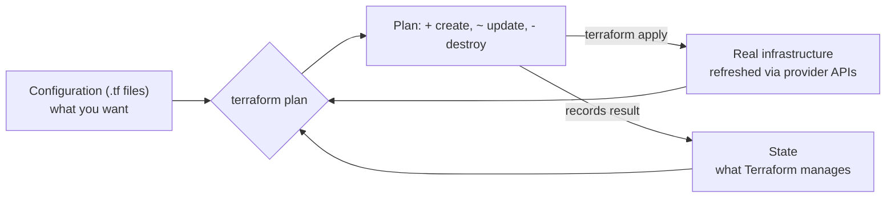
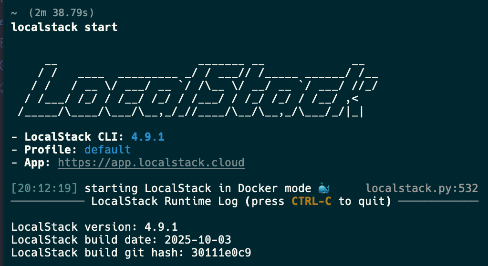
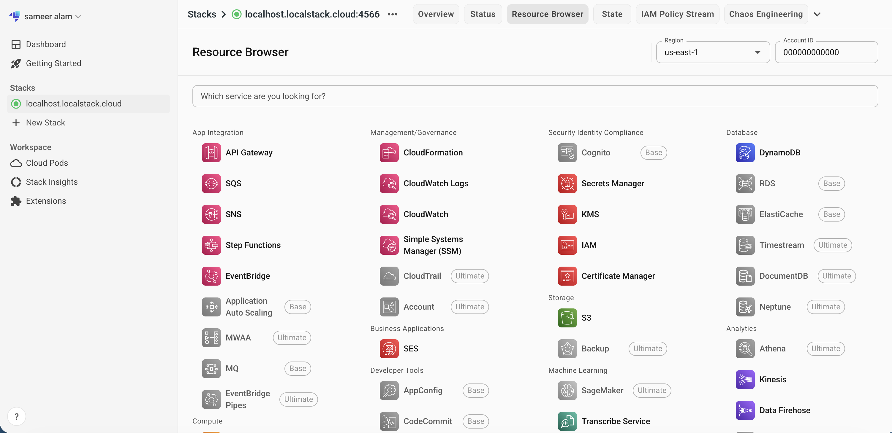

# Terraform Fundamentals and Your First Project

## What You'll Learn

- What Terraform does, and how declarative infrastructure differs from scripts
- Providers, resources, data sources, and state, and how they fit together
- The core workflow: `init`, `plan`, `apply`, `destroy`
- A complete first project you can run on your laptop with no cloud account
- How to point Terraform at AWS or a local AWS emulator safely

## Why Terraform Exists

Clicking through a cloud console doesn't scale: nobody can review it, repeat it exactly, or tell what changed last Tuesday. Shell scripts calling cloud CLIs are repeatable but not **idempotent** — run one twice and you get two load balancers. Terraform lets you declare the end state you want; it works out what to create, change, or delete to get there, and shows you before doing it.

## Mental Model

> You write **configuration** describing desired resources. Terraform keeps **state** recording what it created. On every run it compares configuration, state, and the real infrastructure, and produces a **plan**: the exact set of API calls needed to make reality match the configuration.



## Core Concepts

| Concept | What it is | Example |
|---|---|---|
| **Provider** | A plugin that talks to one platform's API | `hashicorp/aws`, `hashicorp/azurerm`, `hashicorp/google`, `hashicorp/kubernetes` |
| **Resource** | An infrastructure object Terraform creates and manages | `aws_s3_bucket`, `local_file` |
| **Data source** | Read-only lookup of something that already exists | `data "aws_ami" "ubuntu"` |
| **Variable / output** | Inputs to and results from a configuration | `var.region`, `output "bucket_name"` |
| **State** | Terraform's record of managed objects and their IDs | `terraform.tfstate` |
| **Plan** | A preview of changes | `terraform plan` |
| **Module** | A reusable group of resources | `module "network"` |

## HCL in Five Minutes

Terraform configuration uses HCL:

```hcl
# A block: type, labels, and a body
resource "aws_s3_bucket" "logs" {       # resource type, local name
  bucket = "acme-shop-logs"             # argument
  tags = {                              # map
    Environment = "dev"
  }
}

# References connect resources and build the dependency graph
resource "aws_s3_bucket_versioning" "logs" {
  bucket = aws_s3_bucket.logs.id        # <TYPE>.<NAME>.<ATTRIBUTE>
  versioning_configuration {
    status = "Enabled"
  }
}
```

Because `aws_s3_bucket_versioning.logs` references `aws_s3_bucket.logs.id`, Terraform knows to create the bucket first. You rarely need to order things by hand.

## Install

```bash
# macOS
brew tap hashicorp/tap && brew install hashicorp/tap/terraform

# Ubuntu / Debian
wget -O- https://apt.releases.hashicorp.com/gpg | sudo gpg --dearmor -o /usr/share/keyrings/hashicorp-archive-keyring.gpg
echo "deb [signed-by=/usr/share/keyrings/hashicorp-archive-keyring.gpg] https://apt.releases.hashicorp.com $(lsb_release -cs) main" \
  | sudo tee /etc/apt/sources.list.d/hashicorp.list
sudo apt-get update && sudo apt-get install -y terraform

terraform version
```

To switch between versions per project, use a version manager such as `tfenv` or `mise`.

## Your First Project (No Cloud Account Needed)

This project uses the `local` and `random` providers, which create files and random values on your machine. Everything about the workflow is identical to managing real cloud resources.

```text
first-project/
├── versions.tf
├── main.tf
└── outputs.tf
```

```hcl title="versions.tf"
terraform {
  required_version = ">= 1.10"

  required_providers {
    local = {
      source  = "hashicorp/local"
      version = "~> 2.5"
    }
    random = {
      source  = "hashicorp/random"
      version = "~> 3.6"
    }
  }
}
```

```hcl title="main.tf"
resource "random_pet" "server" {
  length = 2
}

resource "local_file" "inventory" {
  filename = "${path.module}/out/inventory.ini"
  content  = <<-EOT
    [web]
    ${random_pet.server.id} ansible_host=10.0.1.11
  EOT
  file_permission = "0644"
}
```

```hcl title="outputs.tf"
output "server_name" {
  value = random_pet.server.id
}

output "inventory_path" {
  value = local_file.inventory.filename
}
```

### 1. Initialize

```bash
cd first-project
terraform init
```

`init` downloads the providers into `.terraform/` and writes **`.terraform.lock.hcl`**, recording the exact provider versions and checksums. Commit the lock file; ignore `.terraform/`.

### 2. Format and validate

```bash
terraform fmt
terraform validate
```

### 3. Plan

```bash
terraform plan -out=tfplan
```

```text
Terraform will perform the following actions:

  # local_file.inventory will be created
  + resource "local_file" "inventory" {
      + content         = (known after apply)
      + filename        = "./out/inventory.ini"
      ...
    }

  # random_pet.server will be created
  + resource "random_pet" "server" {
      + id        = (known after apply)
      + length    = 2
    }

Plan: 2 to add, 0 to change, 0 to destroy.
```

Read every plan. The symbols are `+` create, `~` update in place, `-/+` destroy and recreate, and `-` destroy.

### 4. Apply

```bash
terraform apply tfplan
cat out/inventory.ini
terraform output
```

Applying a saved plan file applies **exactly** what you reviewed.

### 5. Run it again

```bash
terraform plan
# No changes. Your infrastructure matches the configuration.
```

That's idempotency: the desired state already exists, so nothing happens.

### 6. Change something

Edit `length = 3` in `main.tf` and plan again:

```text
  # random_pet.server must be replaced
-/+ resource "random_pet" "server" {
      ~ length    = 2 -> 3 # forces replacement
```

`local_file.inventory` changes too, because it depends on the pet's name. Terraform follows the dependency graph for you.

### 7. Inspect and clean up

```bash
terraform state list
terraform show
terraform destroy
```

## Connecting to AWS

```hcl title="providers.tf"
terraform {
  required_providers {
    aws = {
      source  = "hashicorp/aws"
      version = "~> 6.0"
    }
  }
}

provider "aws" {
  region = "us-east-1"

  default_tags {
    tags = {
      ManagedBy   = "terraform"
      Project     = "shop"
    }
  }
}
```

Credentials come from the standard AWS chain — never from `.tf` files:

```bash
aws configure sso                 # human users: IAM Identity Center
aws sts get-caller-identity       # confirm which account and role you're using
terraform plan
```

In CI, use OIDC federation to assume a role rather than long-lived access keys; see [Testing and CI/CD](testing-and-ci.md).

## Practicing AWS Locally With LocalStack

LocalStack emulates many AWS APIs on your machine, which is useful for practice without cost:




!!! note "LocalStack now requires an auth token"
    Since March 2026, the `localstack/localstack` image is a single image that requires a `LOCALSTACK_AUTH_TOKEN` to start. A free tier is available; create an account, copy your token, and export it before starting LocalStack.

```yaml title="compose.yaml"
services:
  localstack:
    image: localstack/localstack
    ports:
      - "127.0.0.1:4566:4566"
    environment:
      LOCALSTACK_AUTH_TOKEN: ${LOCALSTACK_AUTH_TOKEN:?export LOCALSTACK_AUTH_TOKEN first}
    volumes:
      - "./localstack:/var/lib/localstack"
```

```bash
export LOCALSTACK_AUTH_TOKEN=...   # from your LocalStack account
docker compose up -d
```

Point the AWS provider at it:

```hcl title="providers.tf"
provider "aws" {
  region                      = "us-east-1"
  access_key                  = "test"
  secret_key                  = "test"
  skip_credentials_validation = true
  skip_metadata_api_check     = true
  skip_requesting_account_id  = true
  s3_use_path_style           = true

  endpoints {
    s3  = "http://localhost:4566"
    sts = "http://localhost:4566"
    ec2 = "http://localhost:4566"
  }
}

resource "aws_s3_bucket" "demo" {
  bucket = "demo-bucket"
}
```

```bash
terraform init && terraform apply
aws --endpoint-url http://localhost:4566 s3 ls
```

An emulator is great for learning the workflow; always test against a real sandbox account before production, since emulated behavior can differ.

## Terraform and OpenTofu

After HashiCorp changed Terraform's license in 2023, the community forked it as **OpenTofu** (`tofu` CLI), governed by the Linux Foundation. The language, providers, and workflow on these pages apply to both; each has added some features the other doesn't have. Pick one per organization and pin its version.

## Common Mistakes

- Hardcoding credentials in `.tf` files or committing `terraform.tfvars` with secrets.
- Running `terraform apply` without reading the plan — or applying a fresh plan instead of the one that was reviewed.
- Not committing `.terraform.lock.hcl`, so teammates and CI resolve different provider versions.
- Committing `terraform.tfstate` to Git; it contains secrets and conflicts constantly. Use a remote backend — see [State and Remote Backends](state-and-backends.md).
- Making changes in the console to resources Terraform manages, then being surprised when the next apply reverts them.

## Interview Questions

- What's the difference between declarative infrastructure as code and a script that calls cloud APIs?
- What do `init`, `plan`, and `apply` each do?
- Why commit `.terraform.lock.hcl` but not `terraform.tfstate`?
- How does Terraform decide the order in which to create resources?

## Next

Continue to [Variables, Outputs, and Locals](variables-outputs-and-locals.md).
