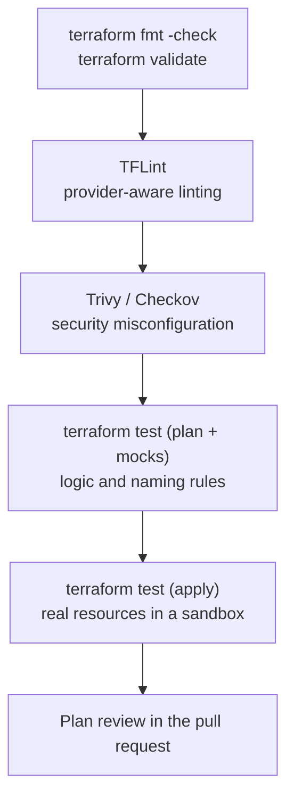

# Testing and CI/CD

## What You'll Learn

- The layers of Terraform testing, from formatting to policy checks
- How to write `terraform test` files, including mock providers for fast unit tests
- A GitHub Actions pipeline: plan on pull requests, apply on merge with approval
- How to authenticate CI to AWS with OIDC instead of access keys
- Scheduled drift detection and policy as code

## The Testing Pyramid



Fast checks run on every commit; slower checks that create real resources run less often or only for modules.

## Static Checks

```bash
terraform fmt -check -recursive      # formatting
terraform init -backend=false        # modules and providers, no state access
terraform validate                   # syntax and internal consistency
```

### TFLint

TFLint catches things `validate` can't, such as invalid instance types or deprecated arguments:

```hcl title=".tflint.hcl"
plugin "terraform" {
  enabled = true
  preset  = "recommended"
}

plugin "aws" {
  enabled = true
  version = "0.40.0"
  source  = "github.com/terraform-linters/tflint-ruleset-aws"
}
```

```bash
tflint --init
tflint --recursive
```

Pin the plugin to a version you've validated.

### Security scanning

```bash
trivy config .
checkov -d .
```

Both flag misconfigurations such as unencrypted buckets, security groups open to `0.0.0.0/0`, and missing logging. Suppress findings only with a written justification next to the resource.

## terraform test

Terraform's built-in test framework runs `.tftest.hcl` files from a `tests/` directory.

### Plan-only tests with a mock provider

Mock providers (Terraform 1.7+) return fake values, so tests run in seconds with no credentials:

```hcl title="modules/web_service/tests/naming.tftest.hcl"
mock_provider "aws" {
  mock_data "aws_ami" {
    defaults = {
      id = "ami-0123456789abcdef0"
    }
  }
}

variables {
  name       = "checkout"
  vpc_id     = "vpc-12345678"
  subnet_ids = ["subnet-aaaa1111", "subnet-bbbb2222"]
}

run "defaults_are_safe" {
  command = plan

  assert {
    condition     = aws_autoscaling_group.this.min_size >= 1
    error_message = "The Auto Scaling group must keep at least one instance."
  }

  assert {
    condition     = aws_launch_template.this.instance_type == "t3.small"
    error_message = "Default instance type should be t3.small."
  }
}

run "rejects_invalid_names" {
  command = plan

  variables {
    name = "Checkout_Service"
  }

  expect_failures = [var.name]
}
```

```bash
cd modules/web_service
terraform init
terraform test
```

```text
tests/naming.tftest.hcl... in progress
  run "defaults_are_safe"... pass
  run "rejects_invalid_names"... pass
tests/naming.tftest.hcl... tearing down
tests/naming.tftest.hcl... pass

Success! 2 passed, 0 failed.
```

### Integration tests that apply

Without a mock provider and with `command = apply`, a run creates real resources, checks them, and destroys them at the end. Run these in a dedicated sandbox account, on a schedule or when a module changes.

## A Plan-and-Apply Pipeline

### Authenticate with OIDC, not access keys

Create an IAM role whose trust policy allows GitHub's OIDC provider for one repository and branch, then let the workflow assume it. No long-lived AWS keys exist to leak.

```json title="Trust policy for the terraform-prod role (excerpt)"
{
  "Effect": "Allow",
  "Principal": { "Federated": "arn:aws:iam::111122223333:oidc-provider/token.actions.githubusercontent.com" },
  "Action": "sts:AssumeRoleWithWebIdentity",
  "Condition": {
    "StringEquals": {
      "token.actions.githubusercontent.com:aud": "sts.amazonaws.com",
      "token.actions.githubusercontent.com:sub": "repo:acme/infrastructure:environment:production"
    }
  }
}
```

Scoping `sub` to the `production` **environment** means only jobs gated by that GitHub environment's approval rules can assume the role.

### The workflow

```yaml title=".github/workflows/terraform.yml"
name: Terraform
on:
  pull_request:
    paths: ["envs/prod/**", "modules/**"]
  push:
    branches: [main]
    paths: ["envs/prod/**", "modules/**"]

permissions:
  contents: read
  id-token: write          # required for OIDC
  pull-requests: write     # to comment the plan

env:
  TF_IN_AUTOMATION: "true"
  WORKDIR: envs/prod

jobs:
  plan:
    runs-on: ubuntu-latest
    defaults:
      run:
        working-directory: ${{ env.WORKDIR }}
    steps:
      - uses: actions/checkout@v5

      - uses: hashicorp/setup-terraform@v3
        with:
          terraform_version: "~1.14.0"

      - uses: aws-actions/configure-aws-credentials@v4
        with:
          role-to-assume: arn:aws:iam::111122223333:role/terraform-prod-plan
          aws-region: us-east-1

      - run: terraform fmt -check -recursive
      - run: terraform init -input=false
      - run: terraform validate

      - name: Plan
        id: plan
        run: terraform plan -input=false -no-color -out=tfplan | tee plan.txt

      - name: Comment plan on the pull request
        if: github.event_name == 'pull_request'
        uses: actions/github-script@v7
        with:
          script: |
            const fs = require('fs');
            const plan = fs.readFileSync('${{ env.WORKDIR }}/plan.txt', 'utf8');
            const body = '### Terraform plan (prod)\n```\n' + plan.slice(-60000) + '\n```';
            await github.rest.issues.createComment({ ...context.repo, issue_number: context.issue.number, body });

  apply:
    if: github.event_name == 'push' && github.ref == 'refs/heads/main'
    needs: plan
    runs-on: ubuntu-latest
    environment: production          # required reviewers approve before this job starts
    defaults:
      run:
        working-directory: ${{ env.WORKDIR }}
    steps:
      - uses: actions/checkout@v5
      - uses: hashicorp/setup-terraform@v3
        with:
          terraform_version: "~1.14.0"
      - uses: aws-actions/configure-aws-credentials@v4
        with:
          role-to-assume: arn:aws:iam::111122223333:role/terraform-prod
          aws-region: us-east-1
      - run: terraform init -input=false
      - run: terraform plan -input=false -out=tfplan
      - run: terraform apply -input=false tfplan
```

Design choices worth noting:

- **Separate plan and apply roles.** The plan role is read-only plus state access, so pull requests from any branch can't change infrastructure.
- **Re-plan on `main` before applying.** A plan from a pull request can be stale by merge time; the apply job plans against the current state and applies exactly that saved plan.
- **Environment approval** gates the apply job and the production role together.
- **Concurrency**: add a `concurrency: terraform-prod` group so two applies never queue into a lock conflict.

## Scheduled Drift Detection

```yaml title=".github/workflows/drift.yml"
name: Drift detection
on:
  schedule:
    - cron: "0 6 * * 1-5"

permissions:
  contents: read
  id-token: write

jobs:
  drift:
    runs-on: ubuntu-latest
    defaults:
      run:
        working-directory: envs/prod
    steps:
      - uses: actions/checkout@v5
      - uses: hashicorp/setup-terraform@v3
        with:
          terraform_version: "~1.14.0"
      - uses: aws-actions/configure-aws-credentials@v4
        with:
          role-to-assume: arn:aws:iam::111122223333:role/terraform-prod-plan
          aws-region: us-east-1
      - run: terraform init -input=false
      - name: Detect drift
        run: |
          set +e
          terraform plan -input=false -detailed-exitcode -no-color > drift.txt
          code=$?
          set -e
          if [ "$code" -eq 2 ]; then
            echo "::warning::Drift detected in prod"; cat drift.txt; exit 1
          fi
          exit "$code"
```

`-detailed-exitcode` returns `0` for no changes, `1` for errors, and `2` when changes are pending. Route the failure to an alert or an automatically opened issue.

## Policy as Code

Check plans against organizational rules before apply:

```bash
terraform show -json tfplan > tfplan.json
conftest test tfplan.json --policy policy/
```

```rego title="policy/tags.rego"
package main

deny contains msg if {
  some rc in input.resource_changes
  rc.type == "aws_s3_bucket"
  "create" in rc.change.actions
  not rc.change.after.tags.CostCenter
  msg := sprintf("%s must have a CostCenter tag", [rc.address])
}
```

HCP Terraform offers Sentinel and OPA policy checks built into runs.

## Common Mistakes

- Applying from laptops with personal admin credentials instead of a pipeline.
- Long-lived AWS access keys stored as CI secrets.
- One role for both plan and apply, so any pull request workflow can change production.
- Applying a stale plan generated before other changes merged.
- Suppressing security scanner findings without a documented reason.
- Only testing modules by applying production.

## Interview Questions

- Describe a CI/CD pipeline for Terraform, from pull request to production apply.
- Why use OIDC federation for CI instead of access keys?
- What does `terraform plan -detailed-exitcode` return, and how would you use it?
- What's the difference between a plan-only `terraform test` with mock providers and an integration test?
- How would you enforce that every S3 bucket has a cost-center tag before it's created?

## Next

Continue to [Interview Questions](interview-questions.md).
