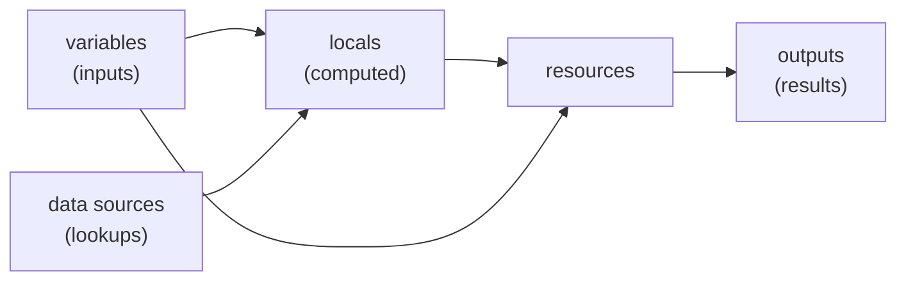

# Variables, Outputs, and Locals

## What You'll Learn

- How to declare typed input variables with validation and sensible defaults
- Every way to set a variable, and which one wins
- Outputs, locals, and data sources, and when to use each
- `count` vs. `for_each`, and why `for_each` is usually safer
- Lifecycle rules, preconditions, and postconditions

## Mental Model

> A Terraform configuration is like a function. **Variables** are its parameters, **locals** are intermediate values computed inside, **data sources** read facts from the outside world, and **outputs** are its return values.



## Input Variables

```hcl title="variables.tf"
variable "environment" {
  description = "Deployment environment."
  type        = string

  validation {
    condition     = contains(["dev", "staging", "prod"], var.environment)
    error_message = "environment must be one of: dev, staging, prod."
  }
}

variable "instance_count" {
  description = "Number of web instances."
  type        = number
  default     = 2

  validation {
    condition     = var.instance_count >= 1 && var.instance_count <= 20
    error_message = "instance_count must be between 1 and 20."
  }
}

variable "allowed_cidrs" {
  description = "CIDR blocks allowed to reach the load balancer."
  type        = list(string)
  default     = []
}

variable "db_password" {
  description = "Database administrator password."
  type        = string
  sensitive   = true
}

variable "buckets" {
  description = "Buckets to create, keyed by short name."
  type = map(object({
    versioning = optional(bool, true)
    retention_days = optional(number)
  }))
  default = {}
}
```

| Type | Example value |
|---|---|
| `string`, `number`, `bool` | `"dev"`, `3`, `true` |
| `list(string)` | `["10.0.0.0/16"]` |
| `set(string)` | Unordered, unique |
| `map(string)` | `{ Team = "payments" }` |
| `object({...})` | A structured record with typed attributes, optionally with `optional()` defaults |
| `any` | Avoid — it disables type checking |

Use `validation` blocks to fail during `plan` with a clear message instead of a cryptic provider error during `apply`.

## Setting Variables, and Precedence

From lowest to highest precedence — later sources override earlier ones:

1. `default` in the variable declaration
2. Environment variables: `TF_VAR_environment=dev`
3. `terraform.tfvars`
4. `terraform.tfvars.json`
5. `*.auto.tfvars` / `*.auto.tfvars.json`, in lexical filename order
6. `-var` and `-var-file` on the command line, in the order given

```hcl title="prod.tfvars"
environment    = "prod"
instance_count = 6
allowed_cidrs  = ["203.0.113.0/24"]
```

```bash
terraform plan -var-file=prod.tfvars
TF_VAR_db_password="$(aws secretsmanager get-secret-value --secret-id prod/db --query SecretString --output text)" \
  terraform plan -var-file=prod.tfvars
```

A variable with no default and no value makes Terraform prompt interactively — in CI that hangs or fails, so always provide values explicitly.

## Sensitive Values

`sensitive = true` redacts a value in plan and apply output:

```text
  + password = (sensitive value)
```

It does **not** keep the value out of state. Anything a resource stores — including database passwords — is written to the state file in plain text. Protect state accordingly; see [State and Remote Backends](state-and-backends.md#protecting-state). Where a provider supports **write-only arguments** or **ephemeral resources** (Terraform 1.10+), use them to pass secrets without persisting them in state.

## Locals

Locals name computed values so you don't repeat expressions:

```hcl title="locals.tf"
locals {
  name_prefix = "shop-${var.environment}"

  common_tags = {
    Project     = "shop"
    Environment = var.environment
    ManagedBy   = "terraform"
  }

  is_prod = var.environment == "prod"
}

resource "aws_s3_bucket" "logs" {
  bucket = "${local.name_prefix}-logs"
  tags   = local.common_tags
}
```

Variables are for things callers set; locals are for things the configuration computes.

## Data Sources

Data sources read existing infrastructure without managing it:

```hcl
data "aws_ami" "ubuntu" {
  most_recent = true
  owners      = ["099720109477"]   # Canonical

  filter {
    name   = "name"
    values = ["ubuntu/images/hvm-ssd-gp3/ubuntu-noble-24.04-amd64-server-*"]
  }
}

data "aws_availability_zones" "available" {
  state = "available"
}

resource "aws_instance" "web" {
  ami           = data.aws_ami.ubuntu.id
  instance_type = "t3.micro"
}
```

Be careful with "most recent" lookups: a new AMI release changes the data source result, and the plan will want to replace instances. Pin an AMI ID variable for production, or add `ignore_changes = [ami]` deliberately.

## Outputs

```hcl title="outputs.tf"
output "bucket_name" {
  description = "Name of the log bucket."
  value       = aws_s3_bucket.logs.bucket
}

output "web_private_ips" {
  value = [for i in aws_instance.web : i.private_ip]
}

output "db_connection_string" {
  value     = "postgresql://admin:${var.db_password}@${aws_db_instance.main.address}:5432/shop"
  sensitive = true
}
```

```bash
terraform output
terraform output -raw bucket_name
terraform output -json | jq
```

Outputs are how modules return values to callers, and how other tools (CI, Ansible inventory scripts) read results.

## Multiple Instances: count vs. for_each

### count — for identical copies

```hcl
resource "aws_instance" "web" {
  count         = var.instance_count
  ami           = data.aws_ami.ubuntu.id
  instance_type = "t3.micro"
  tags          = { Name = "${local.name_prefix}-web-${count.index}" }
}
```

Instances are addressed by **position**: `aws_instance.web[0]`, `[1]`, `[2]`.

### for_each — for distinct, named things

```hcl
variable "users" {
  type    = set(string)
  default = ["alice", "bob", "carol"]
}

resource "aws_iam_user" "team" {
  for_each = var.users
  name     = each.key
}
```

Instances are addressed by **key**: `aws_iam_user.team["bob"]`.

!!! warning "Why for_each is usually safer"
    With `count` over a list `["alice", "bob", "carol"]`, removing `bob` shifts `carol` from index 2 to index 1. Terraform sees index 1 changed from bob to carol and index 2 disappeared — it **destroys and recreates** carol's user. With `for_each`, removing `bob` destroys only `bob`.

Use `count` for "N identical things" or a simple on/off toggle (`count = local.is_prod ? 1 : 0`), and `for_each` for anything with identity.

## for Expressions and Conditionals

```hcl
locals {
  upper_names  = [for u in var.users : upper(u)]
  bucket_arns  = { for k, b in aws_s3_bucket.this : k => b.arn }
  prod_buckets = { for k, v in var.buckets : k => v if v.versioning }
  instance_type = local.is_prod ? "m7i.large" : "t3.micro"
}
```

## Dynamic Blocks

Generate repeated nested blocks from data:

```hcl
resource "aws_security_group" "web" {
  name   = "${local.name_prefix}-web"
  vpc_id = var.vpc_id

  dynamic "ingress" {
    for_each = var.allowed_cidrs
    content {
      description = "HTTPS from ${ingress.value}"
      from_port   = 443
      to_port     = 443
      protocol    = "tcp"
      cidr_blocks = [ingress.value]
    }
  }
}
```

Use dynamic blocks sparingly; deeply nested ones are hard to read.

## Lifecycle Rules

```hcl
resource "aws_db_instance" "main" {
  # ...

  lifecycle {
    prevent_destroy       = true                 # plan fails if anything would destroy it
    create_before_destroy = false
    ignore_changes        = [password]           # managed outside Terraform after creation
  }
}

resource "aws_launch_template" "web" {
  # ...
  lifecycle {
    create_before_destroy = true                 # new version exists before the old is removed
  }
}
```

| Setting | Use it for |
|---|---|
| `prevent_destroy` | Databases, state buckets, anything whose loss is catastrophic |
| `create_before_destroy` | Replacing resources without downtime (launch templates, certificates) |
| `ignore_changes` | Attributes legitimately changed outside Terraform (autoscaling desired count) |
| `replace_triggered_by` | Force replacement when another resource changes |

## Preconditions and Postconditions

```hcl
resource "aws_instance" "web" {
  ami           = var.ami_id
  instance_type = var.instance_type

  lifecycle {
    precondition {
      condition     = data.aws_ec2_instance_type.selected.memory_size >= 2048
      error_message = "The selected instance type needs at least 2 GiB of memory."
    }

    postcondition {
      condition     = self.public_ip == ""
      error_message = "Web instances must not have public IP addresses."
    }
  }
}
```

Preconditions check assumptions before a change; postconditions verify guarantees after it. Both turn silent misconfigurations into clear failures.

## Common Mistakes

- Using `type = any` everywhere, losing all input validation.
- Believing `sensitive = true` keeps a secret out of state.
- Using `count` over a list of named items and triggering mass replacement when one is removed.
- "Most recent" data source lookups in production causing unexpected replacements.
- Overusing `ignore_changes` to hide drift instead of fixing its cause.
- Leaving required variables without values in CI, so runs hang on a prompt.

## Interview Questions

- In what order does Terraform apply variable values from different sources?
- Does `sensitive = true` protect a value in state? What does?
- Why is `for_each` generally safer than `count` for a list of users?
- When would you use `prevent_destroy`, `create_before_destroy`, and `ignore_changes`?
- What's the difference between a variable, a local, and a data source?

## Next

Continue to [State and Remote Backends](state-and-backends.md).
